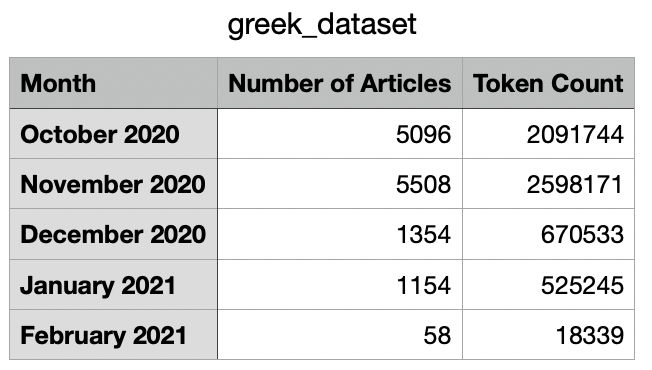
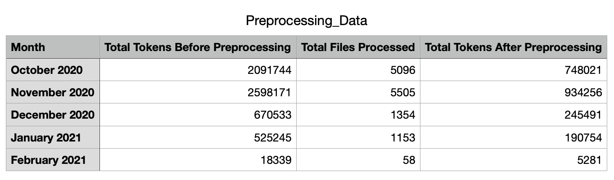
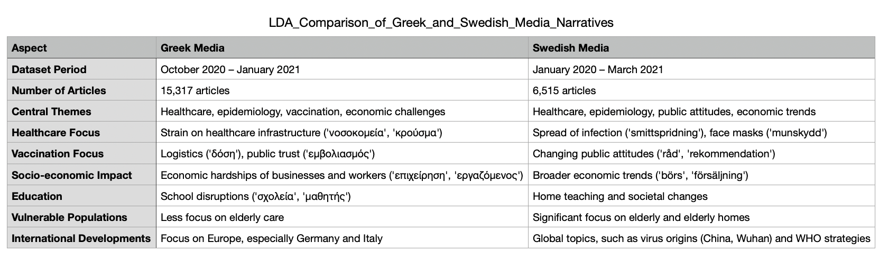
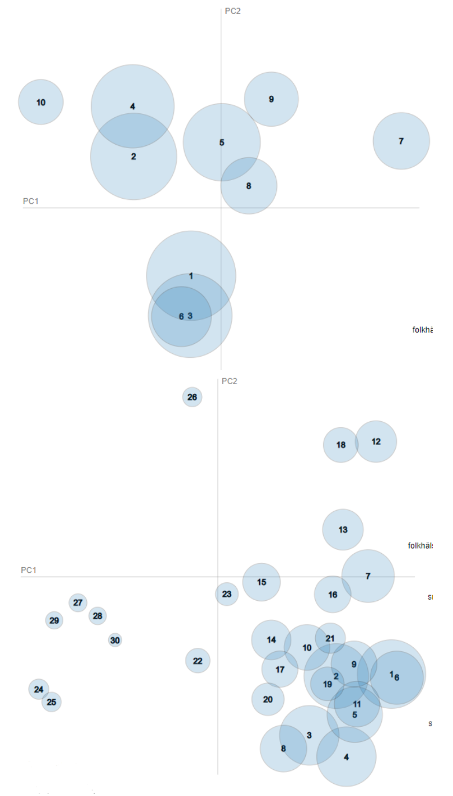
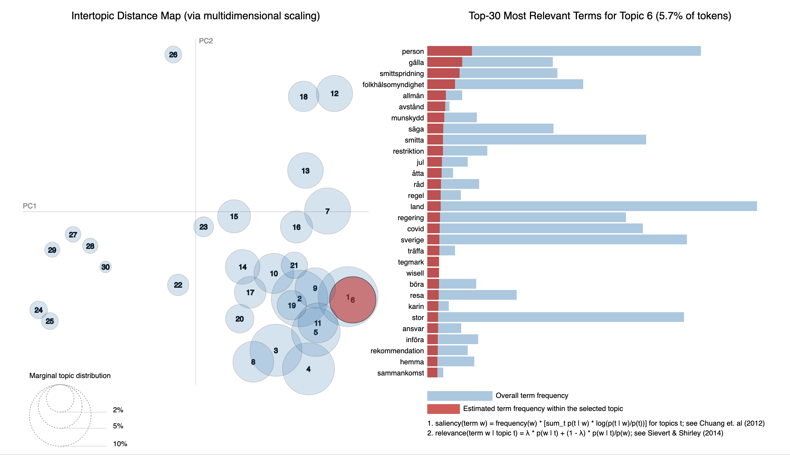
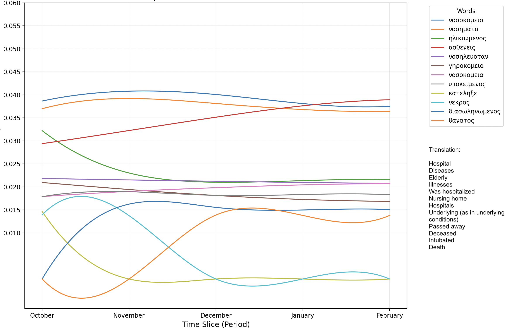
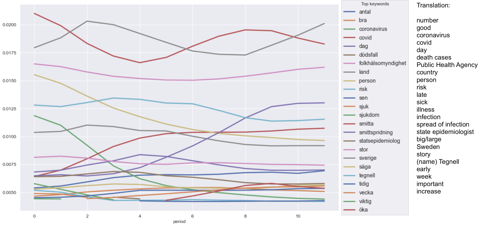
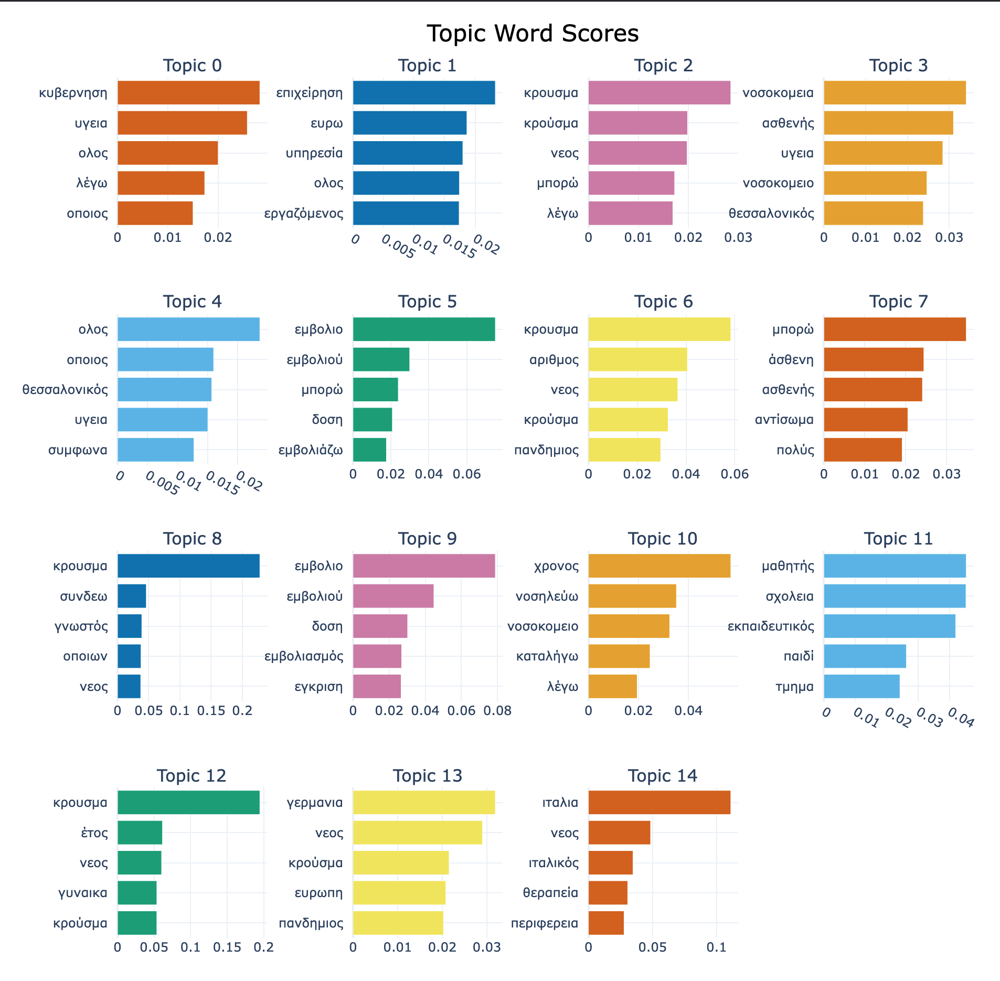
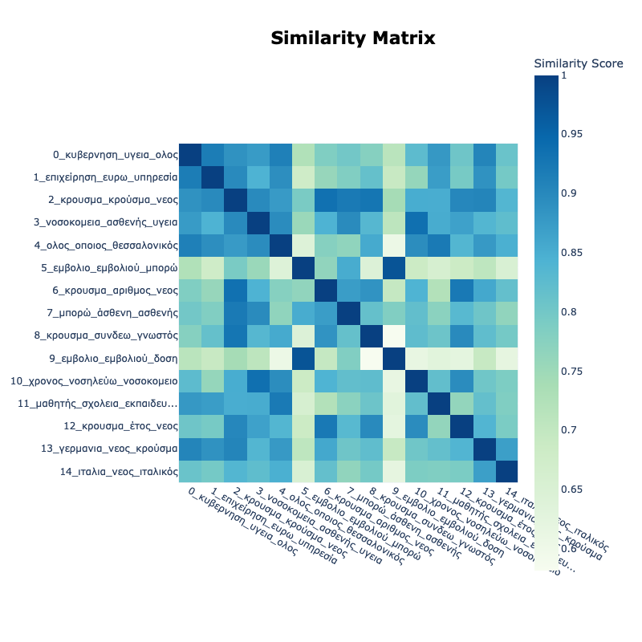

# Chapter 3: Machine Learning for Topic Discovery in Greek News Articles on COVID-19

## Abstract 

This chapter analyzes Greek news coverage of the COVID-19 pandemic from October 2020 to February 2021, focusing on key themes such as 
healthcare strain, vaccination logistics, and economic challenges. Using machine learning techniques—Latent Dirichlet Allocation (LDA),
BERTopic, and Dynamic Topic Modeling (DTM)—we explore how Greek media narratives evolved during this critical period. 
A comparative analysis with Swedish media highlights shared concerns, including public health and socio-economic impacts, 
but reveals cultural differences: Greek media emphasized governmental measures and economic struggles, while Swedish coverage 
focused on institutional trust and voluntary guidelines. These findings underscore the influence of national contexts on pandemic narratives.


## Introduction
In an era increasingly shaped by AI-generated content, analyzing past news articles offers a unique glimpse into unfiltered,
human-generated narratives. Such analysis is particularly valuable when investigating critical global events, like the
COVID-19 pandemic, which profoundly affected societies worldwide. Greek media, like others, played a pivotal role in
shaping public understanding and response to the unfolding crisis. This study focuses on analyzing Greek news coverage
during the COVID-19 pandemic to identify prominent themes and uncover how the media evolved in response to the crisis.
Given the sheer volume of digital text, machine learning techniques such as topic modeling have become invaluable for
deriving meaning from vast textual corpora. This study applies Latent Dirichlet Allocation (LDA), a widely used unsupervised
machine learning method, to explore thematic structures in Greek news articles about COVID-19. By leveraging these tools,
we aim to capture the nuances of how the pandemic was reported in Greek media during the crucial period from October 2020
to February 2021 {cite}`Jelodar2018`

Our approach builds on the methodology used by {cite}`Griciute2023`, who conducted a similar analysis on Swedish media. By comparing
the thematic insights from Greek and Swedish news coverage, we aim to explore potential cultural and societal differences
in the reporting of the pandemic. This comparative lens may provide a deeper understanding of the diverse narratives that
emerged globally during this period of uncertainty.

This chapter outlines the methods, data, and challenges of our project. It also delves into the observed shifts in Greek
media’s thematic focus during the pandemic and discusses how our findings contribute to the broader understanding of
media dynamics during global crises.

## Related Work

The field of topic modeling and text analysis has witnessed significant advancements over the years, particularly in the application of machine learning techniques for deriving insights from large corpora. This study, which explores thematic structures in Greek news articles about COVID-19, integrates Latent Dirichlet Allocation (LDA), neural topic modeling with BERTopic, and dynamic topic modeling to provide a comprehensive analysis.

<h4 style="font-size: 18px;">Latent Dirichlet Allocation (LDA)</h4>
One of the seminal works in topic modeling is the introduction of Latent Dirichlet Allocation (LDA) by {cite}`Blei2003`. This probabilistic model has become a cornerstone for analyzing latent topics in large textual datasets by assuming that documents are mixtures of topics and that topics are distributions over words. LDA’s effectiveness in handling large, unstructured text corpora makes it a suitable choice for analyzing Greek news articles, where the thematic structure may not be immediately evident. The application of LDA in our chapter has common ground to the similar studies, such as {cite}`Asmussen2019`, who demonstrated its capacity to uncover meaningful patterns in textual data.

<h4 style="font-size: 18px;">Neural Topic Modeling with BERTopic</h4>
While LDA remains a powerful tool, recent advancements in neural network-based methods have introduced alternative approaches to topic modeling. {cite}`Grootendorst2022` proposed BERTopic, a neural topic modeling framework that leverages transformer-based embeddings and class-based TF-IDF to enhance the coherence and interpretability of topics. BERTopic’s ability to capture semantic relationships and represent complex linguistic patterns makes it particularly advantageous for processing Greek news articles, where traditional models may struggle with linguistic nuances and morphology.

<h4 style="font-size: 18px;">Dynamic Topic Modeling</h4>
Dynamic topic modeling, first introduced by {cite}`Blei2006`, enables the exploration of topic evolution over time, making it a valuable tool for analyzing longitudinal datasets like the Greek news articles studied in this research. By modeling how thematic structures change, this approach provides insights into the temporal dynamics of public discourse. Such methods have been particularly effective in analyzing large-scale corpora with significant temporal components, as demonstrated in studies like {cite}`Gerlach2018`, which integrated network approaches with dynamic modeling. {cite}`BoydGraber2010` further explored linguistic extensions of topic models, offering valuable methodologies for handling language-specific complexities—a challenge relevant to the Greek language corpus.

<h4 style="font-size: 18px;">Comparative Analysis</h4>
A significant component of our study involves comparing our findings with those presented in the recent work by {cite}`Griciute2023`,which applies topic modeling to explore global narratives surrounding COVID-19. This study focuses on identifying common and divergent themes across Swedish contexts. By integrating insights from their analysis with our findings on Greek news, we aim to uncover unique cultural perspectives and shared patterns in pandemic-related media coverage. The comparative approach enhances the depth of our study and situates it within a broader global discourse.

Beyond this, {cite}`Brusselaers2022`evaluated science communication during the COVID-19 pandemic, providing a framework for comparative analyses of media narratives across different cultural and societal contexts. This work offers additional insight into understanding media dynamics in a global health crisis, complementing the thematic approaches utilized in this study.


## Data
### Source and Scope
The dataset for this study was sourced from {cite}`CLARIN`, a digital infrastructure supporting the development and dissemination of language resources in Greece. It comprises Greek news articles published from October 2020 to February 2021, a critical period during the COVID-19 pandemic. This timeframe captures the height of Greece’s second wave of COVID-19, which began in late October 2020 and led to the imposition of strict nationwide lockdown measures in November. The dataset also encompasses December 2020, when restrictions were partially eased for the holiday season, sparking debates over balancing public health and economic recovery.

January and February 2021 represent the initial stages of Greece’s vaccination campaign, “Eleftheria” (Freedom), which prioritized healthcare workers and elderly populations, marking a significant shift toward pandemic management. By focusing on these months, the dataset allows us to explore how Greek media reflected and shaped public understanding during a period of intense health, societal, and economic challenges.

The articles originate from 16 different sources, encompassing newspapers, magazines, and other media outlets, ensuring a broad representation of editorial styles and viewpoints. In total, the dataset includes 13,170 articles, providing a robust foundation for thematic exploration using topic modeling.

### Data Structure
The dataset captures the linguistic richness and extensive scope of Greek news articles, encompassing both the intricacies of the Greek language and the challenges of large-scale textual analysis. 



Before preprocessing, the dataset contained a total of 5,904,032 tokens distributed across five months: October and November 2020, December 2020, January 2021, and February 2021. Specifically, the token counts before preprocessing were as follows: October had 2,091,744 tokens from 5,096 articles, November had 2,598,171 tokens from 5,508 articles, December had 670,533 tokens from 1,354 articles,  January had 525,245 tokens from 1,154 articles, and February had 18,339 tokens 58 articles. October and November 2020 contained a high volume of articles, reflecting heightened reporting during the early stages of the COVID-19 pandemic. In contrast, the smaller dataset sizes for December 2020, January 202, and December 2021 were partly due to seasonal variations in publication rates and challenges in sourcing complete datasets. Despite these imbalances, the division by month provides an opportunity to examine thematic shifts over time, particularly in response to evolving pandemic events and public health measures.


## Methods

### Preprocessing 
The preprocessing stage was fundamental to preparing the dataset for topic modeling while addressing the unique challenges presented by the Greek language. Our pipeline comprised several steps designed to standardize and clean the text data while preserving semantic meaning.

#### Preprocessing Pipeline
Text standardization formed the initial phase, where all articles underwent case normalization to lowercase. We removed punctuation and symbols to focus on semantic content. A critical decision was made to strip all diacritical marks from the text, addressing the prevalence of orthographic inconsistencies in human-generated content. This standardization was particularly important for our pre-ChatGPT era dataset, where manual typing errors and inconsistent diacritic usage were common.
Tokenization was implemented using the gr-nlp-toolkit, specifically designed for Greek language processing. Following tokenization, we applied lemmatization through multiple Greek-specific NLP tools, ultimately selecting Stanza for its superior handling of Greek morphological structures. The process included comprehensive stopword removal using an extensively curated Greek stopword list, which was iteratively refined to include common auxiliary verbs, prepositions, and contextually non-informative terms.
Named entity recognition and removal constituted the final preprocessing step, eliminating proper nouns and irrelevant entities to focus the analysis on thematic content. The cleaned text was then converted to a Bag-of-Words representation for subsequent topic modeling.
After preprocessing, data redundancy was significantly reduced because the raw data often contained repetitive or irrelevant information, such as stop words, punctuation, and common phrases appearing across multiple documents. Preprocessing steps like tokenization, lowercasing, and stopword removal reduced the dataset size while preserving its semantic essence. Additionally, lemmatization consolidated words with similar meanings into their base forms, further reducing the total token count. 



#### Preprocessing Challenges and Solutions
Several significant challenges emerged during the preprocessing phase, requiring iterative refinements to our approach:

1) Lemmatization Inconsistencies: Despite employing Greek-specific NLP tools {cite}`Loukas2023`, lemmatization proved particularly challenging. Common terms like "εμβόλιο" (vaccine) and its variants "εμβολίου," "εμβολίων" were not consistently reconciled. While we evaluated multiple tools including SpaCy and Stanza, complete resolution of these morphological variations remained elusive, introducing some noise into the final dataset.
2) Stopword Management: Initial implementations revealed inconsistencies in stopword removal, with designated terms occasionally persisting in the output. This required multiple iterations of our stopword list and manual validation of results to ensure comprehensive coverage while preserving semantically significant terms.
3) Orthographic Variations: The human-generated nature of the texts presented numerous orthographic inconsistencies, particularly in diacritic usage and spelling. Our solution to strip diacritical marks, while effective for standardization, required careful monitoring to prevent loss of semantic distinctions in certain contexts.
4) Tool Selection and Integration: The evaluation of different NLP tools (gr-nlp-toolkit, SpaCy, and Stanza) revealed varying levels of effectiveness in handling Greek language specificities. Stanza emerged as the most reliable option, though its integration required careful parameter tuning to optimize performance for our specific use case.

These challenges necessitated a flexible and iterative approach to preprocessing, with continuous refinement of our pipeline based on output analysis and validation. While some issues, particularly in lemmatization, persist in the final dataset, the implemented solutions significantly improved data quality and consistency for subsequent topic modeling analysis.

### Latent Dirichlet Allocation (LDA) Topic Modeling
Following preprocessing, the corpus was analyzed using Latent Dirichlet Allocation (LDA), an unsupervised machine learning algorithm designed to uncover latent thematic structures in large collections of text. The LDA model assumes that each document is a mixture of topics and that each topic is a distribution of words. This probabilistic approach allows for the identification of recurring themes across the dataset. 
To optimize the LDA model, several parameters were carefully tuned. The number of topics, a critical variable that determines the granularity of the thematic analysis, was initially set to 15. This choice aimed to balance capturing nuanced subthemes and ensuring topic coherence. The model displayed the top 10 words associated with each topic to succinctly represent the thematic essence without introducing unnecessary complexity. The number of passes, or iterations over the dataset, was set to 40, ensuring the model achieved a stable solution while maintaining computational efficiency. Controlled randomness was introduced to explore diverse configurations and enhance the robustness of the topics identified. By setting the randomness parameter to 60, the model struck a balance between reproducibility and adaptability across multiple runs.
Moreover, the LDA modeling process itself remains an active area of experimentation. While the initial configuration provided a starting point, we are systematically testing different combinations of parameters to identify the best- performing model. This involves experimenting with the number of topics to ensure the granularity matches the complexity of the data while maintaining coherence and interpretability. For instance, fewer topics risk oversimplifying the themes, while too many could fragment coherent ideas. Similarly, the number of passes and iterations is being adjusted to balance computational efficiency and model stability.


Moreover, the LDA modeling process itself remains an active area of experimentation. While the initial configuration
provided a starting point, we are systematically testing different combinations of parameters to identify the best-
performing model. This involves experimenting with the number of topics to ensure the granularity matches the complexity
of the data while maintaining coherence and interpretability. For instance, fewer topics risk oversimplifying the themes,
while too many could fragment coherent ideas. Similarly, the number of passes and iterations is being adjusted to balance
computational efficiency and model stability.

### Dynamic Topic Modeling (DTM)
Dynamic Topic Modeling (DTM) is a method used to analyze how topics change over time within a collection of text. This approach allows researchers to observe shifts in themes and public discussions, making it especially useful for analyzing Greek news articles during the COVID-19 pandemic. 
In this chapter, we applied the LdaSeqModel from the Gensim library to implement DTM. Our monthly datasets were combined into a single corpus, and a dictionary mapping unique tokens to their IDs was created. 
Each month of the dataset represented a time slice, with the number of articles for each month as follows:
October 2020: 5,074 articles
November 2020: 5,481 articles
December 2020: 1,346 articles
January 2021: 1,148 articles
February 2021: 58 articles
The model was trained using 15 topics, configured to capture topic dynamics across the time slices. Key parameters included a minimum of 3 iterations to ensure convergence, a maximum of 30 iterations for model refinement, and up to 50 iterations for accurate topic inference. These configurations allowed the model to adapt to the varying lengths and thematic complexities of each time slice.
After training the model, the top 10 words for each topic at every time slice were extracted and saved. This structured output allowed for a detailed examination of thematic trends and shifts over time. 

### BERT-Topic

We used BERTopic, a modern neural topic modeling framework that combines transformer-based embeddings with clustering techniques to identify coherent and interpretable topics. 
For embedding the documents, we used the multilingual model paraphrase-multilingual-mpnet-base-v2 {cite}`HuggingFace` from the SentenceTransformers library. This embedding model captures the semantic meaning of sentences across multiple languages, including Greek, making it an ideal choice for this analysis.
To group the documents into topics, we employed the K-Means clustering algorithm, which was configured to generate 15 topics. This number was chosen as a balance between providing sufficient detail and maintaining interpretability across the dataset. Each topic was characterized by its representative words, allowing for clear identification of the primary themes present in the dataset. The analysis was conducted on a monthly basis, with the dataset divided into batches spanning October 2020 to February 2021. This segmentation enabled us to observe temporal shifts in topic distributions and focus areas.
For each monthly dataset, we applied BERTopic to identify the topics and calculate their associated probabilities. The results, including detailed information about the topics and the top representative words for each.

## Results

#### Comperison with Swedish study
##### Latent Dirichlet Allocation (LDA)

The comparison of LDA results from Greek and Swedish COVID-19 media coverage reveals both shared concerns and distinct narratives shaped by cultural and societal contexts. Both studies used LDA to uncover thematic structures, with the Swedish study presenting findings from 10- and 30-topic models, while the Greek study focused on 15 topics. The Swedish dataset, spanning over a year (January 2020–March 2021), included 6,515 articles, while the Greek study analyzed 15,317 articles from a four-month period (October 2020–January 2021).


Healthcare and Epidemiology were central themes in both studies. Greek media emphasized the strain on healthcare infrastructure with topics like "νοσοκομεία" (hospitals) and "κρούσμα" (cases), while Swedish media focused on "smittspridning" (spread of infection) and "munskydd" (face masks), reflecting societal debates on public health measures. Sweden’s Public Health Agency and its spokesperson, Anders Tegnell, featured prominently, reflecting trust in centralized health communication, whereas Greek media referenced governmental actions more broadly under "κυβέρνηση" (government) and "μέτρα" (measures).
Vaccination and public health policies were also significant. Greek media highlighted vaccine logistics, such as "δόση" (dose) and public trust ("εμβολιασμός" for vaccination program). In Sweden, vaccination discourse centered on changing public attitudes, with terms like "råd" (advice) and "rekommendation" (recommendation).
The socio-economic impact of the pandemic was a recurring theme in both datasets but with different emphases. Greek media focused on the economic hardships of businesses and workers ("επιχείρηση" for business and "εργαζόμενος" for worker), while Swedish articles addressed broader economic trends with terms like "börs" (stock exchange) and "försäljning" (sales).
Education and vulnerable populations were treated uniquely in each dataset. Greek media dedicated a topic to school disruptions ("σχολεία" for schools and "μαθητής" for students), while Swedish articles often discussed children and home teaching in connection with societal changes. Swedish media also gave considerable attention to the elderly and the impact of infections in elderly homes, reflecting concerns over protecting vulnerable groups.
International developments varied between the two contexts. Greek media focused on Europe, particularly Germany and Italy, whereas Swedish articles covered global topics such as the virus's origins ("kina" for China and "Wuhan") and WHO strategies.
The Swedish study’s dual visualization of 10- and 30-topic models demonstrated how broader themes like healthcare could be broken down into nuanced subtopics, such as public health debates and economic indicators. In contrast, the Greek study’s 15-topic approach highlighted interconnections between healthcare and epidemiological reporting, balancing thematic clarity with interpretability.
Overall, the LDA results reflect shared priorities, such as healthcare and public policies, while also capturing national differences. Swedish media narratives emphasized public trust in institutions and the country’s unique policy approach, whereas Greek media highlighted the dual crises of public health and economic challenges. This comparison underscores how topic modeling reveals the interplay between media narratives and societal responses during a global crisis.




Greek interactive topic modeling visualization below:

<iframe src="_static/lda_pyldavis_NOV_15_topics.html" width="130%" height="800px" style="border:none;"></iframe>

##### Dynamic Topic Modeling (DTM)
The comparison of DTM results from Greek and Swedish COVID-19 media coverage reveals both overlapping priorities and distinct societal narratives influenced by cultural and policy contexts. While both studies employed DTM to explore evolving themes, the Swedish study analyzed 20 topics over an extended period (January 2020–March 2021) and focused on global and national dynamics, whereas the Greek study examined 15 topics from a shorter timeframe (October 2020–February 2021) with a greater emphasis on domestic challenges.


Greek Media Coverage 
The Greek media narrative, as represented below, highlights a consistent focus on hospital-related terms like "νοσοκομείο" (hospital), "νοσηλευόταν" (was hospitalized), and "γηροκομείο" (nursing home). These terms illustrate the media's emphasis on healthcare infrastructure and the burden it faced during the pandemic. Additionally, terms like "διασωληνωμένος" (intubated) and "θάνατος" (death) show a strong concern with critical cases and mortality.
Over time, the importance of terms like "ηλικιωμένος" (elderly) and "νοσηλευόταν" (was hospitalized) waned slightly, reflecting a shift in reporting focus as the pandemic progressed. The term "θάνατος" (death), however, maintained steady prominence, illustrating the consistent societal concern with mortality throughout the pandemic.
Swedish Media Coverage 
The Swedish media, represented in the visualisation after the Greek media narrative one, also demonstrated a focus on mortality and public health, with terms like "dödsfall" (death cases) and "folkhälsomyndighet" (Public Health Agency). Unlike the Greek dataset, Swedish reporting included a broader contextual narrative involving terms like "smittspridning" (spread of infection) and "statsepidemiolog" (state epidemiologist), highlighting the role of authorities like Anders Tegnell.
Over time, there was a noticeable decline in the use of terms like "dödsfall" (death cases) and "sjukdom" (illness), while terms like "smitta" (infection) and "smittspridning" (spread of infection) rose, reflecting a shift in focus from individual outcomes to broader societal impacts and prevention efforts.
Cross-Cultural Comparison
Both Greek and Swedish media narratives reveal a shared concern for mortality and healthcare during the pandemic. However, key differences emerge in their framing:
Greek Media: Focused heavily on healthcare facilities, elderly patients, and direct outcomes like deaths and intubations. This suggests a narrative centered on the immediate burden on healthcare infrastructure and vulnerable populations.
Swedish Media: Included broader systemic themes such as the role of the Public Health Agency and epidemiological trends. This reflects Sweden's unique approach to pandemic management, emphasizing public health strategies and institutional trust.
Evolution Over Time
While Greek media maintained a steady emphasis on mortality, Swedish media shifted focus from deaths to systemic factors like infection spread. This divergence underscores differences in societal priorities: Greek reporting focused on immediate healthcare challenges, whereas Swedish media highlighted long-term public health strategies. These findings illustrate how cultural and institutional contexts shaped media narratives, offering a nuanced understanding of public discourse during the COVID-19 pandemic.





#### BertTopic
The application of BERTopic to our corpus of Greek COVID-19 news articles identified 15 prominent topics, each representing distinct dimensions of pandemic discourse in the media. The analysis revealed nuanced thematic clusters, reflecting how Greek media covered the multifaceted impacts of COVID-19.
The topic word scores visualization illustrates the distribution and relevance of terms within each topic. 
Healthcare infrastructure emerged as a key theme, with Topic 3 highlighting terms like "νοσοκομεία" (hospitals), "ασθενής" (patient), and "υγεία" (health), emphasizing media focus on the strain on healthcare systems. This concern was echoed in Topic 10, which focused on hospital management and patient care, characterized by terms such as "νοσηλεύω" (hospitalize) and "διασωλήνωση" (intubation).
Vaccination discourse was another major area of coverage, represented by Topics 5 and 9. While Topic 5 centered on vaccine development and rollout logistics, featuring terms like "δόση" (dose) and "παραγωγή" (production), Topic 9 addressed public policy and societal reactions, with terms like "εμβολιασμός" (vaccination program) and "έγκριση" (approval). This distinction underscores the layered nature of vaccine-related reporting in Greek media.
The reporting of case numbers and epidemiological trends formed a significant cluster of topics (Topics 2, 6, and 8). The term "κρούσμα" (case) appeared prominently across these topics, accompanied by contextual terms such as "αριθμός" (number) and "διάδοση" (spread), indicating a focus on both daily case reporting and broader epidemiological developments.
Government measures and economic policies also featured prominently. Topic 0 focused on the government’s health-related responses, evidenced by terms like "κυβέρνηση" (government) and "μέτρα" (measures). This theme intersected with the economic consequences of the pandemic, as seen in Topic 1, where terms like "επιχείρηση" (business) and "εργαζόμενος" (worker) highlighted the financial challenges and labor-related implications of COVID-19.



The similarity matrix revealed notable correlations between topics related to healthcare and case reporting, suggesting integrated coverage of these aspects. For example, Topics 3 (hospitals) and 10 (patient care) exhibited strong thematic overlap, reflecting how media narratives often intertwined healthcare system strain with rising infection rates.
Education and societal impact emerged as distinct themes. Topic 11, featuring terms like "σχολεία" (schools) and "μαθητής" (student), highlighted the unique challenges posed to education during the pandemic. This topic demonstrated minimal overlap with others, indicating that education was treated as a standalone narrative thread.
International developments were captured in Topics 13 and 14, with Greek media focusing on the pandemic’s impact in other European countries. Topic 13 emphasized "γερμανία" (Germany) and "ευρώπη" (Europe), while Topic 14 centered on "ιταλία" (Italy), reflecting a sustained interest in developments abroad.
This thematic analysis underscores the comprehensive and interconnected nature of Greek media’s pandemic coverage, demonstrating how various aspects of the crisis—healthcare, policy, education, and international perspectives—were represented and interrelated in public discourse. The findings reveal the narrative structures and interconnections underpinning Greek media’s reporting during the COVID-19 pandemic.




## Discussion

The comparative analysis of Greek and Swedish media narratives on COVID-19 highlights the significant role cultural, societal, and policy-driven contexts play in shaping pandemic reporting. This study contributes to the understanding of global media dynamics by identifying both shared concerns and distinct differences between the two countries. While our findings align with prior research in some areas, they also reveal unique cultural and institutional influences that shaped the narratives.

Key Findings and Their Importance 
The Greek dataset spans October 2020 to Februare 2021, reflecting a period of heightened public health and economic challenges. Greek media highlighted the government’s centralized response, focusing on strict lockdowns, healthcare strain, and vaccination logistics. Themes like "κυβέρνηση" (government) and "μέτρα" (measures) underscore the centrality of state intervention in managing the crisis. This approach also framed economic challenges faced by businesses and workers, as the media depicted the dual crisis of public health and financial strain.
In contrast, the Swedish dataset spans January 2020 to March 2021, capturing a longer period that includes Sweden's controversial "no lockdown" strategy. Swedish media reflected debates over public health measures rooted in trust-based policies and individual responsibility. Themes such as "råd" (advice) and "rekommendation" (recommendation) reveal how public health communication emphasized voluntary compliance rather than mandates.
These findings underscore how cultural and institutional contexts influence the framing of pandemic narratives. Greek media prioritized state-led measures and economic recovery, while Swedish media reflected a decentralized approach grounded in societal trust and autonomy.

Comparison with Previous Research
Our findings partially align with {cite}`Griciute2023`, who identified shared themes like healthcare and vaccination across global COVID-19 narratives. However, this study diverges by highlighting the stronger emphasis on governmental interventions in Greek media, contrasting with Sweden's focus on institutional trust and voluntary measures. These differences are rooted in the contrasting policy approaches of the two countries. Greece’s centralized strategy necessitated extensive state-led communication, while Sweden’s trust-driven approach relied on the public’s engagement with expert guidance.
This divergence highlights the importance of contextualizing media narratives within their respective cultural and institutional frameworks, advancing the understanding of how societies respond to global crises.

Implications and Applications
The findings provide practical insights for policymakers and communicators. In centralized systems, like Greece’s, effective crisis communication requires emphasizing governmental actions and compliance to ensure public trust and cooperation. Conversely, in decentralized systems like Sweden’s, strategies that leverage institutional trust and foster voluntary adherence are more effective. These lessons can inform the development of tailored communication strategies during future global crises.
Moreover, this study demonstrates the utility of topic modeling techniques, such as LDA and BERTopic, for analyzing large-scale textual datasets. These methods offer valuable tools for uncovering thematic structures and temporal shifts, enabling a deeper understanding of media dynamics.

Areas for Further Research
Future research could expand this analysis by including additional countries to explore global variations in pandemic narratives. Incorporating sentiment analysis or audience reception studies could further enrich the findings, offering insights into how different populations perceived media coverage. Longitudinal analyses of Greek and Swedish media beyond the pandemic’s peak could reveal how narratives evolve over time, particularly during recovery phases or subsequent crises.
Contribution to the Literature
This study contributes to the growing body of literature on media dynamics during global crises by providing a detailed comparative analysis of Greek and Swedish COVID-19 narratives. It highlights the interplay between cultural contexts and media narratives, offering a nuanced perspective on how societies respond to crises. By identifying thematic structures and cultural differences, this research provides a foundation for future studies on media communication during health emergencies and other global challenges.

## Conclusion

The findings illustrate how media narratives are deeply rooted in the cultural, institutional, and societal frameworks of their respective countries. Greek media's emphasis on governmental measures and economic struggles reflects its centralized response to a dual crisis, while Swedish media's focus on public trust and voluntary measures underscores its unique societal values and policy approach. These differences, captured through topic modeling, highlight the interplay between national contexts and pandemic narratives, providing a nuanced understanding of how societies respond to global crises through the lens of their media. This comparative study underscores the importance of incorporating temporal, cultural, and policy-driven dimensions in analyzing media dynamics during unprecedented events like the COVID-19 pandemic.


<a href="https://drive.switch.ch/index.php/s/Ma6NWoJKBlfkwuQ" target="_blank">Click here to access all the data, code, and visualizations</a>

# Tools
ChatGPT, Version 4o, OpenAI: https://chat.openai.com/

Help with formatting and structure

Help with optimizing the code and debugging 


# References

David M. Blei, Andrew Y. Ng, and Michael I. Jordan (2003). Latent Dirichlet Allocation. Journal of Machine Learning Research, 3(Jan):993–1022. Link : "https://www.jmlr.org/papers/volume3/blei03a/blei03a.pdf"

Claus Boye Asmussen and Charles Møller (2019). Smart literature review: A practical topic modelling approach to exploratory literature review. Journal of Big Data, 6(1):1–18 Link: https://journalofbigdata.springeropen.com/articles/10.1186/s40537-019-0255-7

Maarten Grootendorst (2022). BERTopic: Neural topic modeling with a class-based TF-IDF procedure. arXiv preprint arXiv:2203.05794. Link: https://ar5iv.labs.arxiv.org/html/2203.05794

David M. Blei and John D. Lafferty (2006). Dynamic Topic Models. Proceedings of the 23rd International Conference on Machine Learning, pages 113–120. Link: https://mimno.infosci.cornell.edu/info6150/readings/dynamic_topic_models.pdf

Martin Gerlach, Tiago P. Peixoto, and Eduardo G. Altmann (2018). A network approach to topic models. Science Advances, 4(7):eaaq136 Link: https://www.science.org/doi/10.1126/sciadv.aaq1360

Jordan Boyd-Graber (2010). Linguistic Extensions of Topic Models. Princeton University. https://home.cs.colorado.edu/~jbg/docs/2010_jbg_thesis.pdf


```{bibliography} references_chapter3.bib
:style: plain
