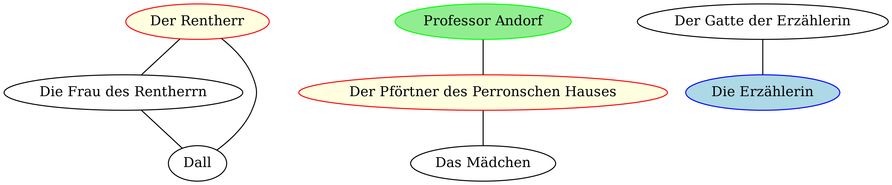
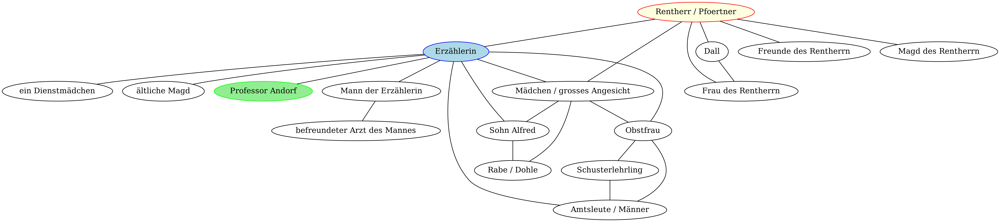
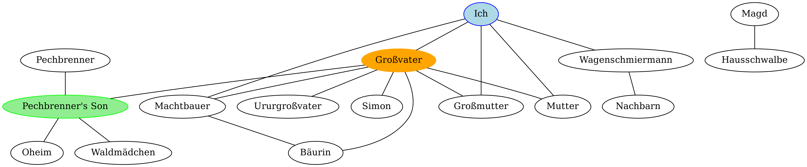
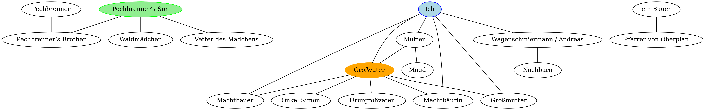

# Chapter 4

*Sonja Huber*

note for the reviewers of the first draft:
see [in brackets] what I plan on adding / changing or general notes. also, the chapters consisting mostly out of bullet points I still need to write.

## Abstract

[I will write this at the very end]

## Introduction

Visualisations of data often give access to new insights and understanding. This also holds true for relationships between characters in literature, as has been explored previously by {cite:t}`moretti2011`, where network theory was used to see implications of said networks into the plot of a literary work. In the play _Hamlet_ by Shakespeare for example, it becomes clear that the character of Hamlet is providing stability to the network and thus is , because without him, the network almost splits in two parts {cite:p}`{see}moretti2011{p. 87-88}`.


Fig. 1: _Character Network Hamlet from {cite:t}`moretti2011`_


Fig. 2: _Character Network Hamlet without the character Hamlet from {cite:t}`moretti2011`_

This, Moretti explains, is because Hamlet "finds himself caught between the space of the Court and that of the anti-Court"{cite:p}`moretti2011{p. 88}`, which is a power-dynamic unusual for Shakespeares' plays {cite:t}`moretti2011` did show quite clearly in network analysis of the character interactions of his plays.
However, this analysis has been done manually by close-reading the texts, limiting the scope of the analysis to a relative small corpus of texts and using a lot of the time of the researcher to read the texts in detail and draw the visualisations by hand. The concept of _distant reading_, also introduced by {cite:t}`moretti2013`, can provide a solution here by zoooming out from the individual texts to provide a larger basis of comparison in a larger corpus.
In this chapter, I will introduce distant reading to the creation of character networks by using a Large Language Model (LLM) to test whether this is a viable alternative to the traditional practice of close-reading. As I will be using literary text as data, this study can be considered a contribution to Computational Literary Studies. Also, as most of the studies done in CLS are done on english works, I chose a german work of literature to largen the pool of studied works by adding one written in a different language  *Bunte Steine* by bohemian-austrian writer Adalbert Stifter, a 19th century work consisting of 6 "Erzählungen"(EN tales).
As well as evaluating the output of the LLM with respect to usefulness to the task of creating character networks, I will visualize the networks -- one for each story as the characters do not overlap -- in order to see whether commonalities or striking differences arise in symmetry or grouping of the nodes from the texts in the same genre. This is also in referenc to a similar to analysis that {cite:t}`moretti2011` is proposing, which seeks to find differences or similarities between the character networks of texts of different genres or countries of origin.


## Relevant Literature

#### Concept of distant reading and usefulness of Graphs in Literary Studies
From the perspective of literary studies, where close readings have a long tradition, the concept of distant reading as proposed by Franco Moretti{cite}`moretti2013` is fundamental for combining the discipline with computational methods. He claims that close reading, where one scholar is intensively reading and studying one text (that is usually part of a canon that is only a very small percentage of all published works) is very limited, and if we want to connect large amounts of literary texts such as world literature seeks to do, the approach has to be changed to _distant reading_ {cite:p}`{see}moretti2013{p. 48}`:

> "we know how to read texts, now let's learn how _not_ to read them. Distand reading: where distance, let me repeat it, _is a condition of knowledge_: it allows you to focus on units that are much smaller or much larger than the text: devices, themes, tropes--or genres and systems. And if, between the very small and the very large, the text itself disappears, well, it is one of those cases when one can justifiably say, Less is more. If we want to understand the system in its entirety, we must accept losing something. We always pay a price for theoretical knowledge: reality is infinitely rich; concepts are abstract, are poor. But it's precisely this 'poverty' that makes it possible to handle them, and therefore to know. This is why less is actually more." {cite:t}`moretti2013{p. 49}`

In other words: if we want to see things that are not visible from up close, we need to "zoom out", while being aware of the fact that we are losing some of the things that were visible from up close in turn.
Some examples for different approaches that examine different topics of interest in literature studies using computational methods, such as can for instance be found here{cite:p}`rosendahlthomsen2023`
While Moretti was, in 2013, mostly thinking about how in a few years it would be possible to investigate stylistic structures of novels in large corpora{cite:p}`{see}moretti2013{p. 164}`, we might right now even be able to investigate more complicated matters such as semantic structures or speech assignment, that deterministic algorithms struggle with.
Some examples for different approaches that examine topics of interest in literature studies, such as Genre, Rhythm or ehtics, usind computational methods can for instance be found here{cite:p}`rosendahlthomsen2023`, an introductory website by Aarhus University.

But now on to the possibilities of character networks for literary studies. To Moretti, character-networks extracted from plays and visualised in graphs are "Time turned into space"{cite:p}`moretti2011{p. 83}` and can be useful to examine the plot as a whole:
> "when we watch a play, we are always in the present: what is on stage, is; and then it disappears. Here, nothing ever disappears. What is done, cannot be undone. Once the Ghost shows up at Elsinore things change forever, whether he is on scene or not, because he is never not there in the network. The past becomes past, yes, but it never disappears from our perception of the plot."{cite:p}`{see}moretti2011{p.84}`

This is of course easier to do with plays than in prose, as it is clear who the characters are on stage with. Still, Moretti writes that "the idea is too tempting to let go"{cite:p}`{see}moretti2011{p.94}`, to not try plot analysis on novels using character networks as well.

In the context of world literature, he considers the creation of these networks as a first step to great possibilities in comparing large amounts of texts, even whole genres:
> One day, after we add to these skeletons the layers of direction, weight and semantics, those richer images will perhaps make us see different genres -- tragedies and comedies; picaresque, gothic, _Bildungsroman_ . . . -- as different shapes; ideally, they may even make visible the micro-patterns out of which these larger network shapes emerge.{cite:p}`{see}moretti2011{p. 102}`

[TODO: Transition]

#### Graphs in DH
Graphs in the digital humanities are usually used to visualise large datasets that contain in some ways linkable entities. The graphs do not only transform the content into a different format but also give access to the contents in the data from a new perspective, that can help to find new angles and perspectives on it and as a consequence can lead to creation of new knowledge.
A common application of this is the creation of social networks surrounding letter exchanges in the early modern age, for example done in the "Six degrees of Francis Bacon"-project by {cite:t}`warren2016` or by the Bullinger project {cite:p}`BullingerDigital2020`, even though only the Francis Bacon project does currently provide a interactible visualisation online while the Bullinger project is currently a "simple" search interface.
Another application of such networks is the building of publication networks such as was done by {cite:t}`vanEck2014`.
Concerning projects working with literary text that, being mostly unstructured data, poses its own challenges, {cite:t}`perri2022` created various visualisations that show the co-occurrences of characters in the works of Tolkien taking place in Middle Earth. Before creating character networks, named entity recognition and coreference resolution had to take place, and it was decided to manually determine the references to one character despite the lower recall {cite:p}`{see}perri2022{p. 3-4}`. The resulting visualisations range from simple character matrices displaying the varying character co-occurrences in the _Lord of the Rings_ Triology {cite:p}`{see}perri2022{fig 1}` to complexer character embedding visulaisations containing edges between nodes of co-occurring characters{cite:p}`{see}perri2022{fig. 5}`.
Another visualisation of a classic literary text is {cite:t}`bostock2012` that visualized characters co-occurrences if those characters occured in the same chapter of Vitor Hugo's work _Les Misérables_.
In literature studies, there have been attempts to visualise data and extract information automated from unstructured data, like in {cite:t}`elson2010`, where conversational character networks are extracted from novels. In other words, a conversational co-occurence is happening if two characters are speaking to one another. To find this, the authors use coreference resolution as well as quoted speech attribution.{cite:p}`{see}elson2010{p. 141-142}`. In the visualisation of the conversational character network, the nodes of characters with more "lines" are larger, and the longer the speech between two characters, the more weight, visualised as width, has the edge. Their most successful method of identifying speach, producing an precision of .95{cite:p}`{see}elson2010{table 2}`, was: "We empirically determined that the most accurate definition of “adjacency” is one where the two characters’ quotes fall within 300 words of one another with no attributed quotes in between."{cite:p}`{see}elson2010{p.143}` Even though the precision is quite satisfactory, the recall of .51{cite:p}`{see}elson2010{table 2}` is not so much. The other methods tried that produced better recall were significantly worse in precision. This task of idenitfying conversations reliably might be one where a LLM might produce better results than a deterministic algorithm. Even though it is out of scope for this chapter to test this extensively, on some of the tales I will do an evaluation.


## Method & Data

### Method

The experiment is to give a LLM the stories as input, with a prompt that lets it extract the relations between the characters in the stories in a manner that can be used as input to a graph software in order to create a graph for each of the stories in the corpus.
Due to it being well-known and, even though not free but still accessible, this experiment will use ChatGPT's Chatinterface with the model GPT-4o{cite:p}`openai2024`. This method shows the capabilities of a LLM in the area of creating character networks that should be possible to scale up to bigger datasets than the one chosen in this experiment is.

For visualising the free and simple tool Graphviz{cite:p}`zotero-2457` will be used. It is under a common public license and can be freely downloaded. Additionally, it can create graphs on basis of text-files with the .dot extension, that should be fairly easy for LLMs to produce as well. So, to summarize, the reasons to choose this tool in particular were 1) it is a free and actively maintained open source tool to secure accessibility, 2) the simplicity of its input format that could also easily be adjusted by a hand if it is found to be faulty.


### Data

The Data used in this experiment are the six german *Erzählungen* contained in Adalbert Stifter(* 1805, † 1868)'s *Bunte Steine* ("colorful stones"): *Granit, Kalkstein, Turmalin, Bergkristall, Katzensilber, Bergmilch*. The text of these stories is freely available on projekt-gutenberg.org {cite:p}`stiftera`.
*Bunte Steine* is associated with the german literary epoch of *Biedermeier*, which is often telling stories of a small scale, nature and families, staying away from the political or epic storylines [add some info about Bunte Steine].

The tales have the following word- and line-counts:

|Title|Word Count|Line Count|
|-----|----------|----------|
|Granit|11'972|244|
|Kalkstein|21'687|501|
|Turmalin|13'800|321|
|Bergkristall|17'342|531|
|Katzensilber|21'955|713|
|Bergmilch|9650|309|

Following the dimensions of data classification suggested by {cite:t}`borgman2015`, the data is of records origin and in no collection, also it has not been processed, contains no metadata. It can be considered raw data in digital form and a primary data with regards to literary studies.


## Experiment


### Experiment Workflow

Due to reasons of accessability, the LLM GPT-4o, as used in the Chat-environment of ChatGPT with the Personal Plus plan was used. In order to ensure no influences from prior conversations, the memory setting was turned off, and for each tale or each time the prompt changed, a new conversation was started.
Through the iterative process of refining the prompts and the approach in general until the results were of acceptable quality, the following prompting-strategy was developed. Early on in the prompt refining process, the prompts were chosen to be in english as equivalent german prompts did perform considerably worse than english ones.
Since the research on prompting so far has found that well-performing prompts on one model has no guarantee to work well with another {cite}`leidinger2023`, it has to be said here that the following might need to be adjusted to any following research that is is examining different texts or using a different model.
The following is the first prompt for each conversation, that instructed the model about the task ahead:

_The first prompt_:

    I will provide you consecutively with multiple parts of a story. Do the following:

    1. Please extract for each appearing character by what different names he or she is referenced in the text. (create section: Character Names in the chat output)

    2. create a tsv-table as output ith the characters in the rows and column header, in the fields a 1 if the characters interact, 0 otherwise. Provide it to me after each part. If not the first part of the story, update the table I will provide to you then with the next part of the story. (provide updated table, containing ONLY that interaction table, nothing else.)

    3. Next: extract what characters speak to each other. (create section: Interaction sentences in the chat output) print the senctence from which you gathered the information of each and every interaction marked in the table for the first time you encounter it between two characters. Also make a short comment where you see the interaction happening.

    Ready?

Then, after the response from the LLM, follows the first 100 lines of the text. That length was approximated to be, on the upper end, below the context of 128k tokens {cite:p}`zotero-2625` one can enter in the ChatGPT interface using the model GPT-4o, but also be short enough to ensure reliable output, as with about 150 lines, instability in the ouput was experienced.

The output from the LLM then might look like this:


Fig. 3: _Example Output in ChatGPT_


The examples the LLM has to provide and the comments to said examples are supposed to show on what sentence the model makes the decision wheter two characters are speaking to each other or not. Additionally, the listing of the references to the characters are supposed to help the model disambiguate. Whether these additional outputs have a measurable effect on the output cannot be evaluated in this experiment, but they do provide a sort of transparency or explainability on a high level to what the model could extract from the literary text.
At the end, a tsv containing a matrix of speaking characters is provided, which can be copied into an empty tsv. This I then store locally, to provide to the model in the following prompt:

_Every prompt except the first, followed by more literary text_:

    Here is the next part of the story and the interaction-table so far. Remember the prompt:

    1. create a tsv-table as output ith the characters in the rows and column header, in the fields a 1 if the characters interact, 0 otherwise. Provide it to me after each part. If not the first part of the story, update the table I will provide to you then with the next part of the story. (provide updated table, containing ONLY that interaction table, nothing else.)

    2. Please extract for each appearing character by what different names he or she is referenced in the text. (create section: Character Names in the chat output)

    3. Next: extract what characters speak to each other. (create section: Interaction sentences in the chat output) print the senctence from which you gathered the information of each and every interaction marked in the table for the first time you encounter it between two characters. Also make a short comment where you see the interaction happening.


    Do all of these steps! Do not skip any of them.


The next 100 or so lines of the literary text are inserted at the end of this prompt. Additionally, I attach the previously produced tsv-file. This, as well as the constant repeating of the prompt is necessary to not let the LLM "lose sight of" the exact prompt and previous interactions as the context largens.
This iterative process continues, until all the text has been given to the model and the last update to the character-matrix in tsv-form has been provided.

Now it is necessary to check the final tsv for obvious errors. Often, as can also be seen in Fig.3, the diagonal that should be all 0, is all 1. Sometimes, the LLM will enter some characters twice into the matrix, or assign values higher than 1 if two characters spoke more than once. For the sake of what the result should be -- a graph only displaying that characters spoke, but not how often -- these small things can be changed by hand.

Then, to finally get from the tsv to a .dot file that can be used to produce a graph using graphviz, it is possible to either prompt the LLM again to convert the file, or do it with a simple script yourself. As the script is a more reliable option -- without very specific prompt, the LLM will vary in the way it makes the graphes look -- I recomment the script. Click below to test with an example tsv of the tale _Bergkristall_:


``` {code-block} python
:class: thebe
import pandas as pd

def tsv_to_dot(tsv_file, dot_file):
    df = pd.read_csv(tsv_file, sep='\t', index_col=0)
    edges = set()

    with open(dot_file, 'w') as f:
        f.write('graph G {\n')

        for source in df.index:
                for target in df.columns:
                    if df.loc[source, target] != 0:  # Adjust condition as needed
                        edge = (source, target)
                        reverse_edge = (target, source)
                        if edge not in edges and reverse_edge not in edges:
                            edges.add(edge)
                            f.write(f'    "{source}" -- "{target}" [weight={df.loc[source, target]}];\n')

        f.write('}\n')

input_tsv = 'Bergkristall_matrix_korrigiert.tsv'
output_dot = 'Bergkristall.dot'

tsv_to_dot(input_tsv, output_dot)

```
```{thebe-button}
```

The resulting .dot file can then be converted into a .png using a bash-prompt:

```bash
dot -Tpng Bergkristall.dot -o Bergkristall.png
```


### Challenges and possible Improvements to the Experiment Workflow

One problem that I was not able to solve in this experiment was that on occasions, the character-matrix is, when copied out of the chat-output, not usable, as it did not contain tabs but four spaces as delimiters. In these cases, I had to remind the model to give me copyable outputs, which solved the problem. Maybe more strict prompting might solve this issue.

In future employment of this workflow in a funded project, working with the GPT-API would provide considerable benefits to the approach shown here using the chat interface, as this would overall automate the process and relieve the researcher of the tedious task of entering many prompts:

As the 100 lines used for each input were just an approximation to a number of tokens that would stay within the context-limit of the model, using a tokenizer to split the text in accurate pieces of a certain number of tokens would probably ensure the stability of the output even more. These automatically split pieces could be then via a program be passed to the GPT-API automatically. Another problem with the Chat-interface use of GPT-4o is that there is a limit for prompting in a certain time-frame,{cite:p}`zotero-2629` depending on the plan. after reaching the limit, the service is suspended for some hours. This makes the Chat-interface unusable for automatic processing of large corpora.
To make the API fully automated, there would need to be a script that would extract the tsv-output directly from the API output.

However, I do think that in the context of a first experiment for AI to create character networks this approach was well chosen, especially if less tech-savvy scholars or students in similar contexts to mine might want to recreate the experiment with their own texts on a small scale without having to first learn how to use or pay for the API.

Another element that might help the analysis is to insert coreference resolution into the text beforehand. How realiably this can be done in prose text, is however, also questionable. The same problems might arise as in the experiment later on, when the model cannot make the connection between two mentioned characters that are only mentioned at the end to be the same person (see Turmalin).

## Results  & Discussion

As this is a quite experimental setting, evaluation can be done only approximately, firstly because there are a lot of cases where it is debatable whether prose text, two people are for certain talking to each other, see also {cite}`moretti2011`. As a result, I do think it is of much use to assign some score to the outputs of the LLMs, as in this quite complex process a lot of factors can influence the results and reliably examining each aspect is far beyond the scope of this chapter. However, I would like to have a look at some [TODO: specify] of the stories and what was produced, and compare the networks to character network propositions that I have made.

Figure 4 shows the network produced for the tale _Turmalin_. As we will see, the extraction process did work quite poorly with this example.


Fig. 4: _generated Character Network Turmalin, colored for comparison with Figure 5_

The six characters shown in Figure 4 show very little connection, implicating three pairs of characters only interacting with each other. The character network I created manually, reading the story and keeping track of when characters spoke to each other (or were reported to do so) is displayed in Figure 5. 


Fig. 5: _manually created Character Network Turmalin, coloring for comparison with Figure 4_

First of, the character disambiguation [TODO: ist es wirklich das?] of _Der Rentherr_ (orange), which is the same character as _Der Pförtner (des Perronschen Hauses)(orange)_ was not successful. However, the fact that this is the same person is only revealed towards the end of the tale. It seems that the LLM either did not recognise this connection, or did not go back to edit past entries in the interaction matrix. The last output showing the different names for the characters, as seen in Figure 6, is mentioning the characters seperately, so this is consistent with the generated network in Figure 4. 
Apart from the possibly challenging late revelation of how the characters relate to each other, it is unclear why GPT 4o produced such a poor character network for this tale in particular. As can be seen in Figure 5, most of the characters do not appear in the network at all, edges are missing and also an explicit conversation between _Professor Andorf_ (green) and _Erzählerin_ was not caught but one that I could not reconstruct between _Professor Andorf_ and _Der Pförtner_ was drawn. The attempt at explainability with the sentences that should show the textpassages where the interactions happen did fail here as well, as interactions between _Professor Andorf_ and _Erzählerin_ are reported, but are not in the matrix. 


Fig. 6: _generated character names for Turmalin_

The second tale I had a look at manually is _Granit_. The generated and mannualy created networks look quite similar, as is visible in Figures 7 and 8. This network did turn out quite well. The only problem here are the "Binnenerzählungen". The main one in _Granit_ is told by _Großvater_(color) and handlet von _Pechbrenner's Son_ (color). The two character did not interact themselves. Also, a shorter story, containing the interaction between _Bauer_ and _Pfarrer_, that _Großvater_ told was not detected at all. Interestingly, GPT 4o did find an interaction between a bird and a person, which is in the text simply that the bird was disturbed by the person.
Overall however, this network is of pretty high quality.


Fig. 7: _generated Character Network Granit, colored for comparison with Figure 8_


Fig. 8: manually created Character Network Granit, colored for comparison with Figure 7_


Fig. 4: _Character Network Bergmilch_


Fig. 5: _Character Network Granit_


Fig. 6: _Character Network Kalkstein_


Fig. 7: _Character Network Katzensilber_


Fig. 8: _Character Network Turmalin_


Fig. 9: _Character Network Bergkristall_


questions concerning the quality:
- character disambiguation is still imperfect (see example turmalin)
- what sort of interactions are seen as interactions? even though I clearly prompted (well debatable)
- what happens in Binnenerzählungen (Granit und Turmalin)
- compare to my own network of 1-2 stories I will reread
- How well are the results explainable by what the model did output as well

some Interpretation of the results
- connectedness of nodes and the relevance of the characters
- similar networks? differences?

Methodenreflektion
- Link to the comparison of texts from different genres, outside the canon that are fastly emerging (AI generated, fanfiction) that are too large for 1 or a group of researchers to read
- What about this is DH (to me?)

Since this 


## Conclusion

What did become clear the most during the evaluation of the results to me was that each step of this undertaking I did could be researched further. First of, prose being a more difficult textform to extract interactions from than dramas, where do humans see interactions, where does the AI? can these things be aligned with prompt engineering, or is it not necessarily in the most interest to do so?

- what i could not show
- what should be researched further
- what i could show
- potentials of AI in this field

open questions:
- what do I do with the networks I do not correct

## Ethics

## Bibliography

```{bibliography} references_chapter4.bib
:style: plain
```
## Tools

```{bibliography} tools_refs_chapter4.bib
:style: plain
```
