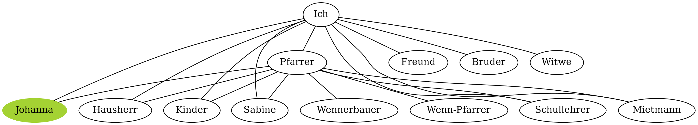

# Chapter 4

*Sonja Huber*

## Abstract

This chapter examines the use of Large Language Models (LLMs), specifically GPT-4o, to automate the creation of character networks from literary texts, traditionally extracted by close reading. Drawing on Franco Moretti’s distant reading concept, the study applies computational methods to Adalbert Stifter’s *Bunte Steine*, a collection of six 19th-century German tales, extracting character interactions and visualizing networks using Graphviz.
By analyzing three tales—Turmalin, Granit, and Kalkstein—the chapter compares the contents of LLM-generated networks against manually constructed ones. While the LLM captures some interactions, it struggles with nested narratives, coreference resolution, and the complexity of prose. These limitations suggest the need for a refined approach, such as preprocessing for named entities or more prompt engineering.
The findings highlight both the potential and the limitations of current AI models in literary analysis. Although the networks fall are not quite satisfactory for broad-scale comparisons as envisioned by Moretti, the experiment illustrates how AI could enhance computational approaches to literature and inspire further research.

## Introduction

Visualisations of data give access to new insights and understanding. This also holds true for relationships between characters in literature, as has been explored previously by {cite:t}`moretti2011`, where network theory was used to see implications of said networks into the plot of a literary work. 
This analysis has been done manually by close-reading the texts, limiting the scope of the analysis to a small corpus of texts and using a lot of the time of the researcher to read the texts in detail and draw the visualisations by hand. The concept of _distant reading_, also introduced by {cite:t}`moretti2013`, can provide a solution here by zooming out from the individual texts to provide a larger basis of comparison in a larger corpus.
In this chapter, I will introduce distant reading to the creation of character networks by using a Large Language Model (LLM) to test whether this is a viable alternative to the traditional practice of close-reading. As I will be using literary text as data, this study can be considered to be a contribution to Computational Literary Studies (CLS). Also, as most of the studies done in CLS are done on english works, I chose a german work of literature to widen the texts that have been researched. In particular, I chose *Bunte Steine* by bohemian-austrian writer Adalbert Stifter, a 19th century work consisting of 6 "Erzählungen"(EN tales).
As well as producing a character network for each story, I will compare three of the generated networks with character networks that I created manually to determine how useful or representative of the plot the outputs of the LLM are. Ideally, the networks could then be used to show whether commonalities or striking differences arise in symmetry or grouping of the nodes from the texts in the same genre. This is also in reference to a similar analysis that {cite:t}`moretti2011` is proposing, which seeks to find differences or similarities between the character networks of texts of different genres or countries of origin.


## Relevant Literature

#### Concept of distant reading and usefulness of Graphs in Literary Studies
From the perspective of literary studies, where _close readings_ have a long tradition, _distant reading_ as proposed by Franco Moretti{cite}`moretti2013` is fundamental for integrating computational methods into the discipline. He claims that close reading, where one scholar is intensively reading and studying one text, a text that is usually part of a canon that is only a very small percentage of all published works, is very limited, and if we want to connect large amounts of literary texts such as world literature seeks to do, the approach has to be changed to _distant reading_ {cite:p}`{see}moretti2013{p. 48}`:

> "we know how to read texts, now let's learn how _not_ to read them. Distand reading: where distance, let me repeat it, _is a condition of knowledge_: it allows you to focus on units that are much smaller or much larger than the text: devices, themes, tropes--or genres and systems. And if, between the very small and the very large, the text itself disappears, well, it is one of those cases when one can justifiably say, Less is more. If we want to understand the system in its entirety, we must accept losing something. We always pay a price for theoretical knowledge: reality is infinitely rich; concepts are abstract, are poor. But it's precisely this 'poverty' that makes it possible to handle them, and therefore to know. This is why less is actually more." {cite:t}`moretti2013{p. 49}`

In other words: if we want to examine objects or phenomena that are not visible from up close, we need to "zoom out", while being aware of the fact that we are losing some of the what was visible from up close in turn. An example of this Moretti shows in the play _Hamlet_ by Shakespeare: it becomes evident that the character of Hamlet is a sort of connector between the characters in the play, providing stability to the network because without him, the network almost splits in two parts {cite:p}`{see}moretti2011{p. 87-88}`.


Fig. 1: _Character Network Hamlet from {cite:t}`moretti2011`_


Fig. 2: _Character Network Hamlet without the character Hamlet from {cite:t}`moretti2011`_

This, Moretti explains, is because Hamlet "finds himself caught between the space of the Court and that of the anti-Court"{cite:p}`moretti2011{p. 88}`, which is a power-dynamic unusual for Shakespeares' plays {cite:t}`moretti2011`.
Apart from analyses that such networks can provide for the work they portray, these networks can also be compared amongst texts from larger text corpora within a genre or epoch, finding similarities or differences that might make up these categories.
WMoretti was, in 2013, mostly thinking about how in a few years it would be possible to investigate stylistic structures of novels using large corpora {cite:p}`{see}moretti2013{p. 164}`. With AI, we might right now even be able to investigate more complicated matters such as semantic structures or speech assignment that deterministic algorithms struggle with. 

The possibilities offered by character networks for literary studies are the following. To Moretti, character-networks extracted from plays and visualised in graphs are "Time turned into space"{cite:p}`moretti2011{p. 83}` and can be useful to examine the plot as a whole:
> "when we watch a play, we are always in the present: what is on stage, is; and then it disappears. Here, nothing ever disappears. What is done, cannot be undone. Once the Ghost shows up at Elsinore things change forever, whether he is on scene or not, because he is never not there in the network. The past becomes past, yes, but it never disappears from our perception of the plot."{cite:p}`{see}moretti2011{p.84}`

This is of course easier to do with plays than in prose, as it is evident who the characters are on stage with. Still, Moretti writes that "the idea is too tempting to let go"{cite:p}`{see}moretti2011{p.94}`, to not try plot analysis on novels using character networks as well.

In the context of world literature, he considers the creation of these networks as a first step to great possibilities in comparing large amounts of texts, even whole genres:
> One day, after we add to these skeletons the layers of direction, weight and semantics, those richer images will perhaps make us see different genres -- tragedies and comedies; picaresque, gothic, _Bildungsroman_ . . . -- as different shapes; ideally, they may even make visible the micro-patterns out of which these larger network shapes emerge.{cite:p}`{see}moretti2011{p. 102}`

Making this vision possible is even more desirable considering the vastly growing amounts of books in genres outside the mentioned canon, that are nevertheless consumed by many: Romantasy, Sci-Fi, books created by AI, to name only a few. There are too few scholars to read them by hand, but the relevance of researching these areas of literature is also undeniable.

#### Graphs in DH
Graphs in the digital humanities are usually used to visualise large datasets that contain in some ways linkable entities. The graphs do not only transform the content into a different format but also give access to the data from a new perspective and as a consequence can lead to new knowledge.
A common application of this is the creation of social networks surrounding letter exchanges in the early modern age, for example done in the "Six degrees of Francis Bacon"-project by {cite:t}`warren2016` or by the Bullinger project {cite:p}`BullingerDigital2020`, even though only the Francis Bacon project does currently provide a interactible visualisation online while the Bullinger project is currently a "simple" search interface.
Another application of such networks is the building of publication networks such as was done by {cite:t}`vanEck2014`.
Working with literary text poses its own challenges as it is mostly unstructured data.{cite:t}`perri2022` created various visualisations that show the co-occurrences of characters in the works of Tolkien taking place in Middle Earth. Before creating character networks, named entity recognition and coreference resolution had to take place, and it was decided to determine the references to one character beforehand despite the lower recall {cite:p}`{see}perri2022{p. 3-4}`. The resulting visualisations range from simple character matrices displaying the varying character co-occurrences in the _Lord of the Rings_ Triology {cite:p}`{see}perri2022{fig 1}` to more complex character embedding visualisations containing edges between nodes of co-occurring characters {cite:p}`{see}perri2022{fig. 5}`.
Another visualisation of a classic literary text is {cite:t}`bostock2012` that visualized characters co-occurrences if those characters occured in the same chapter of Victor Hugo's work _Les Misérables_.
In literature studies, there have been attempts to visualise data and extract information automated from unstructured data, like in {cite:t}`elson2010`, where conversational character networks are extracted from novels. In other words, a conversational co-occurence is happening if two characters are speaking to one another. To find this, the authors use coreference resolution as well as quoted speech attribution.{cite:p}`{see}elson2010{p. 141-142}`. In the visualisation of the conversational character network, the nodes of characters with more "lines" are larger, and the longer the speech between two characters, the more weight, visualised as width, has the edge. Their most successful method of identifying speech, producing a precision of 0.95 {cite:p}`{see}elson2010{table 2}`, was: "We empirically determined that the most accurate definition of “adjacency” is one where the two characters’ quotes fall within 300 words of one another with no attributed quotes in between." {cite:p}`{see}elson2010{p.143}` Even though the precision is quite satisfactory, the recall of 0.51 {cite:p}`{see}elson2010{table 2}` is not so much. Other methods that produced better recall were significantly worse in precision. 
This only somewhat satisfying deterministic method to identifying conversation reliably raises the question whether a LLM might produce better results.


## Data

The Data used in this experiment are the six german *Erzählungen* contained in Adalbert Stifter's (* 1805, † 1868) *Bunte Steine* ("colorful stones"): *Granit, Kalkstein, Turmalin, Bergkristall, Katzensilber, Bergmilch* (EN granite, limestone, tourmaline, rock crystal, muscovite, cave milk ). The text of these stories is freely available at projekt-gutenberg.org {cite:p}`stiftera`.
For the current state of literary research on *Bunte Steine* see {cite:p}`begemann2017`.

The tales have the following word- and line-counts that influencial to the experiment:

|Title|Word Count|Line Count|
|-----|----------|----------|
|Granit|11'972|244|
|Kalkstein|21'687|501|
|Turmalin|13'800|321|
|Bergkristall|17'342|531|
|Katzensilber|21'955|713|
|Bergmilch|9650|309|


## Experiment
The experiment is to give a LLM the stories as input, with a prompt that lets it extract the relations between the characters in the stories in a manner that can be used as input to a graph software in order to create a graph for each of the stories in the corpus.
Due to it being well-known and, even though not free but still accessible, this experiment will use ChatGPT's chat interface with the model GPT-4o{cite:p}`openai2024`. This method tests the potential of a LLM in generating character networks, with the capability to scale to larger datasets than the one chosen for this experiment.

For visualising the free and simple tool Graphviz{cite:p}`zotero-2457` will be used. It is under a common public license and can be freely downloaded. Additionally, it can create graphs on basis of text-files with the dot extension. So, to summarize, the reasons to choose this tool in particular were 1) it is a free and actively maintained open source tool to secure accessibility, 2) the simplicity of its input format that could also easily be adjusted by hand if it is found to be faulty.

### Experiment Workflow

Due to reasons of accessability, the LLM GPT-4o, as used in the chat environment of ChatGPT with the _Personal Plus_ plan was used. In order to ensure no influences from prior conversations, the memory setting was turned off, and for each tale or each time the prompt changed, a new conversation was started.
Through the iterative process of refining the prompts and the approach in general until the results were of acceptable quality, the following prompting-strategy was developed. Early on in the prompt refining process, the prompts were chosen to be in english as equivalent german prompts did perform considerably worse than english ones.
Since the research on prompting so far has found that well-performing prompts on one model has no guarantee to work well with another {cite}`leidinger2023`, the prompts might need to be adjusted in any following research that is examining different texts or using a different model.
The following is the first prompt for each conversation, that instructed the model about the task ahead:

_The first prompt_:

    I will provide you consecutively with multiple parts of a story. Do the following:

    1. Please extract for each appearing character by what different names he or she is referenced in the text. (create section: Character Names in the chat output)

    2. create a tsv-table as output ith the characters in the rows and column header, in the fields a 1 if the characters interact, 0 otherwise. Provide it to me after each part. If not the first part of the story, update the table I will provide to you then with the next part of the story. (provide updated table, containing ONLY that interaction table, nothing else.)

    3. Next: extract what characters speak to each other. (create section: Interaction sentences in the chat output) print the senctence from which you gathered the information of each and every interaction marked in the table for the first time you encounter it between two characters. Also make a short comment where you see the interaction happening.

    Ready?

After the response from the LLM follows the first 100 lines of the text. That length was approximated to be, on the upper end, below the context of 128k tokens one can enter in the ChatGPT interface using the model GPT-4o {cite:p}`zotero-2625`, but also be short enough to ensure reliable output, as with about 150 lines, instability in the ouput was experienced.

The output from the LLM then might look like this:


Fig. 3: _Example Output in ChatGPT from the story Granit_


The examples the LLM has to provide and the comments to said examples are supposed to show on what sentence the model makes the decision wheter two characters are speaking to each other or not. Additionally, the listing of the references to the characters are supposed to help the model disambiguate. Whether these additional outputs have a measurable effect on the output cannot be evaluated in the scope of this experiment, but they do provide a sort of transparency or explainability on a high level to what the model could extract from the literary text.
At the end, a tsv containing a matrix of speaking characters is provided, which can be copied into an empty tsv file. This is then stored locally, to provide to the model in the following prompt:

_Every prompt except the first, followed by more literary text_:

    Here is the next part of the story and the interaction-table so far. Remember the prompt:

    1. create a tsv-table as output ith the characters in the rows and column header, in the fields a 1 if the characters interact, 0 otherwise. Provide it to me after each part. If not the first part of the story, update the table I will provide to you then with the next part of the story. (provide updated table, containing ONLY that interaction table, nothing else.)

    2. Please extract for each appearing character by what different names he or she is referenced in the text. (create section: Character Names in the chat output)

    3. Next: extract what characters speak to each other. (create section: Interaction sentences in the chat output) print the senctence from which you gathered the information of each and every interaction marked in the table for the first time you encounter it between two characters. Also make a short comment where you see the interaction happening.


    Do all of these steps! Do not skip any of them.


The next 100 or so lines of the literary text are inserted at the end of this prompt. Additionally, I attach the previously produced tsv-file. This, as well as the constant repeating of the prompt is necessary to not let the LLM "lose sight of" the exact prompt and previous interactions as the context largens.
This iterative process continues, until all the text has been given to the model and the last update to the character-matrix in tsv-form has been provided.

Now it is necessary to check the final tsv for obvious errors. Often, as can also be seen in figure 3, the diagonal that should be all 0 is all 1. Sometimes, the LLM will enter some characters twice into the matrix, or assign values higher than 1 if two characters spoke more than once. For the sake of what the result should be -- a graph only displaying that characters spoke, but not how often -- these small things were changed by hand.

Then, to finally get from the tsv to a dot file that can be used to produce a graph using Graphviz, it is possible to either prompt the LLM again to convert the file, or do it with a simple script yourself. As the script is a more reliable option -- without very specific prompt, the LLM will vary in the way it configures the graphes -- I recommend the script. Click the button below to convert the tsv-file to a dot-file:


``` {code-block} python
:class: thebe
import pandas as pd

def tsv_to_dot(tsv_file, dot_file):
    df = pd.read_csv(tsv_file, sep='\t', index_col=0)
    edges = set()

    with open(dot_file, 'w') as f:
        f.write('graph G {\n')

        for source in df.index:
                for target in df.columns:
                    if df.loc[source, target] != 0:  # Adjust condition as needed
                        edge = (source, target)
                        reverse_edge = (target, source)
                        if edge not in edges and reverse_edge not in edges:
                            edges.add(edge)
                            f.write(f'    "{source}" -- "{target}" [weight={df.loc[source, target]}];\n')

        f.write('}\n')

input_tsv = 'Bergkristall.tsv'
output_dot = 'Bergkristall.dot'

tsv_to_dot(input_tsv, output_dot)

```
```{thebe-button}
```

The resulting dot file can then be converted into a png using a bash-prompt:

```bash
dot -Tpng Bergkristall.dot -o Bergkristall.png
```


### Challenges and possible Improvements to the Experiment Workflow

In future employment of this workflow in a funded project, working with the GPT-API could provide considerable benefits to the approach shown here using the chat interface, as this would overall automate the process and relieve the researcher of the tedious task of entering many prompts:

As the 100 lines used for each input were just an approximation to a number of tokens that would stay within the context-limit of the model, using a tokenizer to split the text in accurate pieces of a certain number of tokens would ensure the stability of the output even more. These automatically split pieces could then via a script be passed to the GPT-API automatically. Another problem with the chat interface use of GPT-4o is that there is a limit for prompting in a certain time-frame {cite:p}`zotero-2629`, depending on the plan. After reaching the limit, the service is suspended for some hours. This makes the chat interface unusable for automatic processing of large corpora.
To fully automate the API, there would also need to be a script that extracts the tsv-output directly from the API output.

However, I do think that in the context of a first experiment for AI to create character networks this approach was well chosen, especially if scholars with limited technological expertise or students in similar contexts to mine might want to recreate this or a similar experiment with their own texts on a small scale without having to first learn how to use or pay for the API.

Another element that might help the analysis is to insert coreference resolution into the text beforehand. How realiably this can be done in prose text, is however, also questionable, as for example {cite:p}`{see}perri2022{p. 3-4}` had to compromise in this aspect, by determining the references per character beforehand. Additionally, the same problems might arise as in the experiment later on, when the automated coreference resolution program cannot make the connection between two mentioned characters that are only mentioned at the end to be the same person (see example _Turmalin_).

One problem that I was not able to solve in this experiment was that on occasions, the character-matrix is not usable when copied out of the chat-output, as it did not contain tabs but four spaces as delimiters. In these cases, I had to remind the model to give me copyable outputs, which solved the problem. Maybe even more strict prompting could solve this issue.

## Results  & Discussion

As this is a quite experimental setting, evaluation will be done only quantitatively, also because I do not think it is of much use to assign some score to the outputs of the LLMs, as in this quite complex process a lot of factors can influence the results and reliably examining each aspect is far beyond the scope of this chapter. However, I will examine three of the stories and compare the networks to character network propositions that I have made.
Also, the links to the conversations with ChatGPT can be found in [here](#chats). There is currently (January 2025) no integrated way to archive or download the conversations, only a sharing option.

Figure 4 shows the network produced for the tale _Turmalin_. As we will see, the extraction process did work quite poorly with this text.


Fig. 4: _generated Character Network Turmalin, colored for comparison with Figure 5_

The eight characters shown in figure 4 show very little connection, implicating three groups of characters only interacting within each other. The character network I created manually, reading the story and keeping track of when characters spoke to each other (or were reported to do so) is displayed in figure 5. 


Fig. 5: _manually created Character Network Turmalin, coloring for comparison with Figure 4_

First of, recognizing that _Der Rentherr_ (orange) is the same character as _Der Pförtner (des Perronschen Hauses)_ (orange) was not successful. However, the fact that this is the same person is only revealed towards the end of the tale. It seems that the LLM either did not recognise this connection, or did not edit past entries in the interaction matrix. The last output showing the different names for the characters, as seen in figure 6, is mentioning the characters separately, so this is consistent with the generated network in figure 4. 
Apart from the possibly challenging late revelation of how the characters relate to each other, it is unclear why GPT 4o produced such a poor character network for this tale in particular. As can be seen in figure 5, most of the characters do not appear in the network at all, edges are missing and also an explicit conversation between _Professor Andorf_ (green) and _Erzählerin_ was not caught but one that I could not reconstruct between _Professor Andorf_ and _Der Pförtner_ did get an edge. The attempt at explainability with the sentences that should show the textpassages where the interactions happen failed here as well, as interactions between _Professor Andorf_ and _Erzählerin_ was reported in the chat output, but are not in the matrix. 


Fig. 6: _generated character names for Turmalin_

The second tale I had a look at manually is _Granit_, and its network did turn out quite well. The generated and mannualy created networks look quite similar, as is visible in figures 7 and 8. The only problem here are the stories within stories. The main one in _Granit_ is told by _Großvater_(orange) and is about _Pechbrenner's Son_ (green). The two characters did not interact themselves. Also, a shorter story, containing the interaction between _ein Bauer_ and _Pfarrer von Oberplan_, that _Großvater_ told was not detected at all. Interestingly, GPT 4o instead did find an interaction between a bird and a person, which is in the text simply that the bird was disturbed by the person.
Overall however, this network is of pretty high quality.


Fig. 7: _generated Character Network Granit, colored for comparison with Figure 8_


Fig. 8: _manually created Character Network Granit, colored for comparison with Figure 7_

As a last example, figures 9 and 10 show the character networks of _Kalkstein_, the longest of the six stories. While the comparison is not showing as extreme of a difference as in _Turmalin_, there is still quite a big difference between the two versions. Again, the model seems to have had a problem with the way the story is composed of three stories within each other. The outer-most layer is _Ich (Erzähler 1)_ telling the story that his _Friend (Erzähler 2)_ told a group of friends. The retelling of the story is the middle layer, and the inner-most layer is the _Pfarrer im Karr_ telling the story of his upbringing and life. The last layer can be seen by some of the that only have connections to the _Pfarrer im Karr_, which are colored green. These characters mostly are missing in the generated network.

Fig. 9: _generated Character Network Kalkstein_


Fig. 10: _manually created Character Network Kalkstein_

Of course, having only these three examples, no generally valid claims about the structure of the plot of Adalberts Stifters work or the literary period. Nevertheless, what in the manually created examples becomes visibles is that one commonality of these three stories is that there are in each story a few characters with quite high connectivity that often are connected to stories within stories, or disjunct groups that also refer to stories within stories. However, the generated networks do overall lack in that aspect.

As it is beyond the scope of this chapter to contain analysis of all the six stories, nevertheless here are the generated networks of the three remaining stories that an interesed reader might compare on her or his own.


Fig. 10: _Character Network Bergmilch_


Fig. 11: _Character Network Katzensilber_


Fig. 12: _Character Network Bergkristall_

## Conclusion

The immediate result seems to be that the generated networks do not capture the interactions sufficiently, or in other words, that AI is not ready for this task (yet). However, to view this through a more productive lens, what parts of the experiment should be reexamined or improved in another attempt to this task?
First of, all the characters in the text have to be are captured. Maybe this problem might be adressed through verticalizing the text and applying named entity recognition and coreference resolution that the model then can take into account additionally to the raw text and adapted prompting. 
Secondly, it should be made even more clear what the model should be considering an interaction for a given research question. I did leave it somewhat open to interpretation of the model, but defining this more clearly might provide more consistent results.
Then, to do a larger-scale extraction, setting up an automated way to extract the interaction matrix via an API or similar way would be a must.
Also, to determine whether stories within stories really are something that a LLM overlooks, a corpus with texts with simpler stroy structure could be tested.

So, having pinpointed the issues that AI faces while extracting character networks from prose text, it seems that Morettis vision of being able to compare large bodies of networks from different genres, times or authors is not yet quite possible using AI tools, or needs further investigation than the insight that this experiment provides. However, maybe there are different elements of books that might be extracted similarly in large scale using AI and used to compare the works they were extracted from, so I want to encourage other scholars to do their own experiments, to see whether AI can accellerate the research concerning other aspects in Computational Literary Studies. 

## Tools

```{bibliography} tools_refs_chapter4.bib
:style: plain
```

Comment: ChatGPT (GPT 4o) was used for the experiment as well as for the creation of the abstract and rewording of a few parts of the text. 

## Bibliography

```{bibliography} references_chapter4.bib
:style: plain
```


## Chats 

- Turmalin: https://chatgpt.com/share/6773da7b-2a4c-8002-9cbe-58c9be2702c4 

- Bergkristall: https://chatgpt.com/share/677e594e-57ac-8002-8c94-eac2a4a79791 

- Granit: https://chatgpt.com/share/677e59f7-f0ac-8002-a1c4-8cf3e841b20c

- Bergmilch: https://chatgpt.com/share/677e5a55-fedc-8002-9daf-9794c811af4b

- Katzensilber: https://chatgpt.com/share/673df5cf-c9f8-8002-be3a-40aac921a6ed

- Kalkstein: https://chatgpt.com/share/677e5a82-0314-8002-9cd9-187e6f9d0ae8

all shares created on 08.01.2025