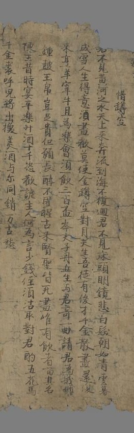
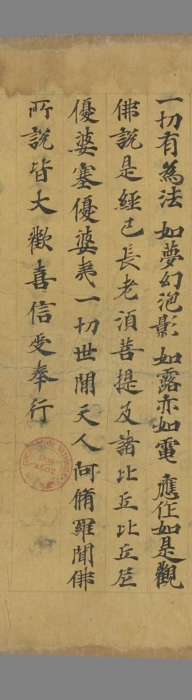
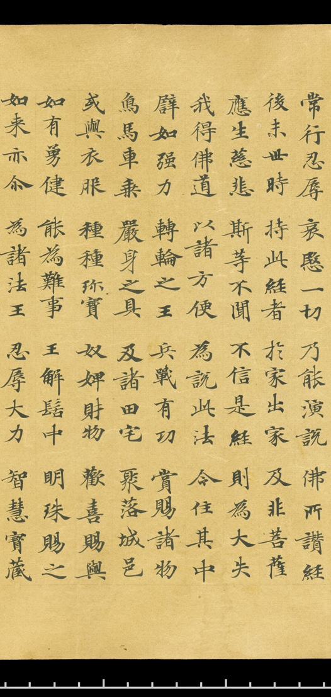
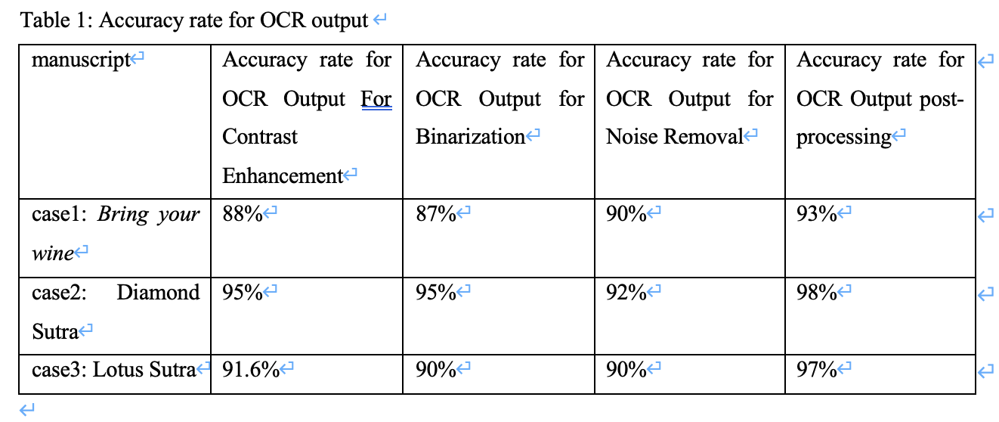
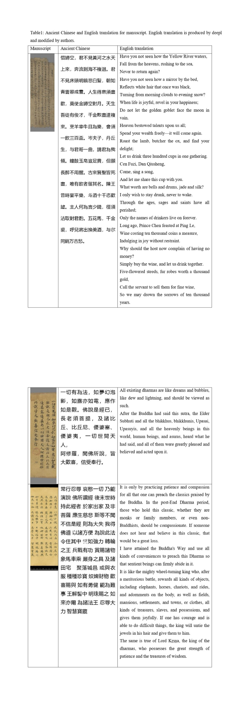
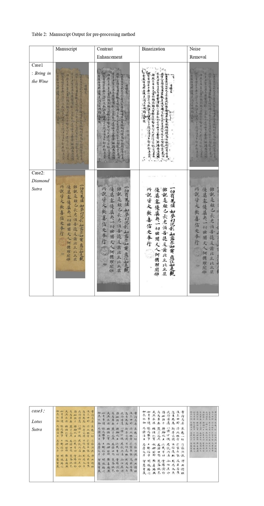

---
jupytext:
  formats: ipynb,md:myst
  text_representation:
    extension: .md
    format_name: myst
    format_version: 0.13
    jupytext_version: 1.16.6
kernelspec:
  display_name: base
  language: python
  name: python3
---

# Chapter 6: Enhancing OCR Accuracy for Historical Texts: A Study on Pre-processing and Post-processing Techniques for Dunhuang Manuscripts

## Abstract

This research delves into the application of optical character recognition (OCR) on Dunhuang manuscripts, a collection of historical documents found within the Mogao Caves. These documents are celebrated for their linguistic diversity and cultural significance. In this work, we highlight the performances of pre-processing and post-processing techniques in improving OCR recognition accuracy regarding classical Chinese. Pre-processing methods, such as contrast enhancement, binarization, and denoising, improve image quality by increasing input clarity and reducing recognition errors. On the other hand, post-processing effectively optimizes the OCR output by correcting errors based on the linguistic context and recovering missing text using a classical Chinese language model, GuwenBERT. However, its performance largely depends on the quality of the surrounding context. This analysis provides insights into how pre-processing and post-processing can be effectively used to breathe new life into ancient Dunhuang manuscripts, ensuring their digital preservation for generations to come.

## Introduction

The Dunhuang manuscripts, discovered in the Mogao Caves along the ancient Silk Road, represent a remarkable repository of cultural, religious, and linguistic heritage. Between the late 4th and early 11th centuries, these manuscripts encompass diverse languages and scripts, including Chinese, Tibetan, Sanskrit, and Uyghur, reflecting the rich multicultural exchanges of medieval Central Asia. Preserving and studying these invaluable documents is critical for understanding the historical interactions of societies along the Silk Road. 
 
In recent years, significant progress has been made in the digitization of historical Dunhuang manuscripts, with institutions and projects worldwide working to preserve and study these invaluable cultural artifacts. For example, the International Dunhuang Project (IDP) has played an essential role in the digitization and cataloging of the Dunhuang manuscripts, creating a huge digital archive accessible globally. These projects focus on preserving high-resolution images, detailed metadata, and transliterations. They simplify manuscript studies and promote collaborations, not only safeguarded these fragile documents but also enabled further computational analysis.

OCR (Optical Character Recognition) technology converts text from images into an electronically readable format, enabling it to be processed as plain text. This transformation facilitates tasks such as editing and text manipulation using language technology tools, including machine translation, text analysis, question-answering systems, and search engines {cite:p}`hajiali2023ocr`. For ancient Chinese texts, such as the Dunhuang manuscripts, Optical Character Recognition (OCR) has become an essential tool in the digitization workflow. OCR facilitates the extraction of text from images, enabling large-scale analysis of these historical texts. 

However, applying OCR to Dunhuang manuscripts poses unique challenges. These manuscripts are handwritten, with diverse styles, faded ink, and ancient, non-standard characters. Unlike modern printed texts, where OCR achieves high accuracy, the complexity of classical Chinese requires specialized approaches. For low-resolution or incomplete texts, like those in the Dunhuang collection, additional processing and optimization are needed to improve recognition accuracy. In this study, we explore methods to tailor OCR techniques specifically for classical Chinese texts, combining pre-processing and post-processing to tackle the unique challenges of these manuscripts.
 
OCR processing can be divided into pre-processing and post-processing, as they address different challenges in improving text recognition. Pre-processing focuses on enhancing image quality using methods such as contrast enhancement, binarization, and noise removal. These techniques help highlight text, eliminate ambiguous regions, and reduce visual distortions, resulting in clearer input for OCR systems. Post-processing, on the other hand, refines the recognized text by leveraging language models, such as a classical Chinese BERT model GuwenBERT, to correct errors based on context and fill in missing text.

For OCR selection, we used Gulian OCR, developed by the Gulian Company, it’s an intelligent OCR system for ancient Chinese books based on machine learning technology. It specializes in processing various formats, including block-printed and handwritten manuscripts. The system features smart layout analysis, intelligent component annotation, and efficient output of annotated results. By applying Gulian OCR, we analyzed the OCR recognition results at two stages: before and after pre-processing, and before and after post-processing. By separately analyzing the impact of pre-processing and post-processing, we aimed to evaluate how each step contributes to improving text recognition accuracy and reducing errors. This dual comparison provides a comprehensive understanding of the roles and effectiveness of pre-processing and post-processing in the OCR workflow.

## Literature Review

During the 2010s, advancements in deep learning technology, along with significant improvements in computing power and the expansion of training datasets, have significantly boosted OCR performance. Previous research showed that recognition accuracies have surpassed 99% for handwritten Arabic numerals and 95% for English alphabets {cite:p}`baldominos2019survey`. However, Chinese character recognition lags behind with an accuracy of around 90%, largely due to the complexity and vast diversity of its character set {cite:p}`chang2019optical`. Nevertheless, continuous efforts in expanding databases and developing deep learning models have been steadily improving its performanc {cite:p}`lee2024algorithm`.

Traditional full-text digital libraries, particularly those focused on premodern Chinese texts, have traditionally employed a centralized, top-down approach to content creation and management. In this framework, written materials are first scanned, then transcribed either manually or using Optical Character Recognition (OCR) technology. The transcriptions are subsequently corrected, reviewed, annotated, and ultimately integrated into a system in their final usable form. This method, rooted in conventional academic publishing practices, offers a straightforward and technically manageable approach. However, while effective for smaller-scale projects, this strategy struggles to address the challenges posed by the rapid growth of digitization efforts and the increasing volume of historical materials being processed by libraries globally {cite:p}`sturgeon2021chinese`.

For OCR pre-processing, binarization is crucial for improving OCR accuracy by separating text from the background in historical manuscripts {cite:p}`yousefi2011image`. Contrast adjustment can effectively handle lighting variations and the irregular distribution of image illumination (Harraj & Raissouni, 2015). Noise removal is a critical pre-processing step to enhance OCR accuracy by addressing background noise and text interference resulting from scanning or document quality issues {cite:p}`farahmand2013document`.
 
For OCR post-processing using language models, it generally involves three key steps: identifying incorrect words, generating a list of possible corrections, and selecting the most accurate replacement for the erroneous word. It employs language models and word embeddings to detect recognition errors introduced by OCR systems. Furthermore, the generative capabilities of these models are utilized to propose correction candidates, offering potential solutions for addressing these errors {cite:p}`hajiali2023ocr`.

## Dataset

To demonstrate the diversity and limitations of OCR recognition capabilities, we have selected several ancient Chinese manuscripts from the Dunhuang collection. Most of these electronic manuscripts come from the IDP (International Dunhuang Project), a global collaborative project aimed at preserving and studying the Dunhuang heritage and its invaluable manuscripts. IDP project's main task is to digitize and preserve a vast collection of ancient manuscripts, documents, and artworks from the Dunhuang Mogao Caves and surrounding areas.

These manuscripts include ancient Chinese poetry and Buddhist scriptures. One of them is "Bring in the Wine", a famous poem by the renowned Chinese poet Li Bai, which appears in the Dunhuang manuscripts under the title "惜罇空". One manuscript is excerpt from the Diamond Sutra, the other one is excerpt from the Lotus Sutra. The images of the manuscripts can be viewed as following pictures. 



https://idp.bl.uk/collection/F276F7E1C246524B9946D0C23C36818D/


https://idp.bl.uk/collection/D057BD4CD4C8044DA09DEB268058A3F5/?return=%2Fcollection%2F%3Fterm%3DPelliot%2520chinois%25202895


https://idp.bl.uk/collection/D506A896798E440CADF24647329370DE/?return=%2Fcollection%2F%3Fterm_pressmark%255B%255D%3Dpc%253AS.1048

For the purpose of this paper and to improve the accuracy of OCR in processing ancient Chinese texts, this study employs pre-processing and post-processing methods. This study also uses natural language processing methods and the pre-trained language model GuwenBERT. GuwenBERT is trained on the Daizhige corpus of ancient Chinese literature, which includes 15,694 ancient texts with a total character count of 1.7 billion. It enhances OCR accuracy in two primary ways: correcting recognition errors and improving the interpretation of ambiguous or partially recognized characters. The model's training on the Daizhige corpus allows it to understand the linguistic patterns and contextual relationships specific to ancient Chinese, enabling it to predict and correct errors that traditional OCR systems might overlook. Additionally, GuwenBERT is used to refine the segmentation of text, ensuring that phrases, clauses, and sentences are correctly parsed according to classical grammar. It also assists in the disambiguation of polysemous characters, leveraging contextual cues to identify the most likely meanings within the document. These capabilities make GuwenBERT an essential tool for bridging the gap between modern NLP techniques and the complex demands of ancient text digitization, ultimately facilitating more accurate digital preservation and analysis of historical Chinese literature.

## Method

n this section, it exhaustively details some approaches about pre-processing and post-processing explicitly. Pre-processing is the initial stage of image processing before being sent to the OCR process {cite:p}`mursari2021effectiveness`. Pre-processing and post-processing are essential stages in Optical Character Recognition systems to enhance accuracy and output quality. Pre-processing focuses on improving OCR accuracy by pre-processing the input document images {cite:p}`el2015toward`. These steps prepare the image for accurate character recognition. Post-processing, on the other hand, is applied to the OCR output to refine results by correcting errors using language models, dictionaries, or rule-based algorithms. Together, these techniques significantly improve OCR performance and reliability in practical applications.

During the OCR recognition process, we specifically use OCR platforms designed for recognizing and processing ancient Chinese texts called Gulian OCR Systems, which are specially developed to handle ancient documents, manuscripts, inscriptions, and other non-modern texts using optical character recognition technology. 

### Pre-processing

In this section, we provide the key stages of our approach, specifically focusing on contrast enhancement, binarization, noise removal. Each of these steps plays a crucial role in preparing the image for accurate and reliable OCR  processing. In code script, it uses OpenCV which is a powerful computer vision library. 

#### Contrast enhancement

The key step in our pre-processing approaches is to improve the contrast of the overall objects present in the processed image. This part will use CLAHE as a useful contrast enhancement. CLAHE enhances the contrast of an image by locally applying Contrast Limited Histogram Equalization on small data regions called tiles rather than the entire image {cite:p}`hajiali2023ocr`. To prevent over-amplification of noise, a contrast limit is imposed on the histogram, clipping excessive intensity frequencies and redistributing them. After processing, the regions are seamlessly combined through interpolation, resulting in a full image with improved contrast and detail, particularly in areas with varying lighting conditions. Contrast enhancement methods are not intended to increase or supplement the intrinsic structural information in an image but rather to improve the image contrast and hypothetically to enhance particular characteristics {cite:p}`hajiali2023ocr`.

By enhancing local contrast and preserving fine details, CLAHE improves the visibility of text in challenging conditions, such as faded documents or low-light photographs. Its ability to prevent over-enhancement of noise through contrast clipping ensures better OCR accuracy without introducing artifacts. Overall, CLAHE contributes to more reliable text recognition by creating a balanced and clear input image for OCR systems. We can process these images directly using python code and OpenCV. 

```python
import cv2
# Read the grayscale image
image = cv2.imread('2.jpg', cv2.IMREAD_GRAYSCALE)
# Create a CLAHE object
clahe = cv2.createCLAHE(clipLimit=2.0, tileGridSize=(8, 8))
# Apply CLAHE
enhanced_image = clahe.apply(image)
# Save or display the result
cv2.imwrite('enhanced_image.jpg', enhanced_image)
cv2.imshow('Enhanced Image', enhanced_image)
cv2.waitKey(0)
cv2.destroyAllWindows()
```

#### Binarization

Ancient Chinese paper was primarily made from plant fibers such as hemp, mulberry bark, and straw. Over time, due to oxidation, the paper gradually turns yellow. Text written on these pages also deteriorates with age, with the paper becoming discolored or showing signs of fingerprints and ink diffusion. The combination of yellowed backgrounds and faded ink increases the difficulty of OCR in recognizing ancient Chinese manuscripts.

Image binarization plays a critical role in processing ancient Chinese manuscripts. The purpose of this method is to binarize images of handwritten or printed text documents captured via scanning or photography. The desired outcome of the binarization process is a two-tone image with black text displayed on a white background {cite:p}`bloechle2023yinyang`.This effectively removes the yellowed background, retaining only the text, which makes it more prominent. It also enhances the contrast between the text and the background, significantly improving OCR's ability to detect and recognize the text.

Image binarization uses Otsu's method. It begins with grayscale conversion, where color images are simplified into grayscale to reduce data complexity. Binarization is performed using Otsu's algorithm, which automatically determines the optimal threshold to classify pixels into foreground and background based on intensity distribution {cite:p}`yousefi2011image`. In conclusion, image binarization, particularly using Otsu's method, serves as a powerful tool for enhancing the legibility of ancient Chinese manuscripts and overcoming the challenges posed by their aged and degraded conditions. By transforming yellowed backgrounds into clean white and improving the visibility of faded text, binarization not only aids in preserving these historical documents but also significantly enhances the accuracy and efficiency of OCR systems. This process paves the way for better digital archiving and broader accessibility to ancient textual heritage. The code script using OTSU is below.

```python
import cv2
# Load the image in grayscale
image = cv2.imread('2.jpg', cv2.IMREAD_GRAYSCALE)
# Apply Otsu's binarization
_, binary_image = cv2.threshold(image, 0, 255, cv2.THRESH_BINARY + cv2.THRESH_OTSU)
# Save the result
cv2.imwrite('binary_image_otsu.jpg', binary_image)
```

#### Noise Removal

Noise in OCR images can come from various sources, including background artifacts, irregularities in lighting, distortion from scanning or image acquisition, and other irrelevant patterns that might interfere with text recognition {cite:p}`farahmand2013document`. Pre-processing noise removal helps OCR models by reducing unnecessary information, allowing them to focus on the relevant characters and improve text extraction.

Non-Local Means denoising is an advanced technique commonly used in optical character recognition pre-processing to reduce noise in images while preserving important details like text clarity. This method is particularly effective in scenarios where traditional denoising methods like Gaussian or median filters may blur the image or distort text. Unlike conventional filters that only consider nearby pixels, NLM denoising compares every pixel with all other pixels in the image, looking for similar patterns or regions. One of the main benefits of NLM is its ability to preserve sharp edges and fine details (such as text) while reducing noise. It avoids the blurring effects that might be seen with other techniques, making it especially valuable for OCR applications where text clarity is critical.

Non-Local Means denoising offers a powerful solution for improving OCR results by reducing noise while preserving important image details. Its ability to handle complex noise patterns makes it ideal for pre-processing scanned or photographed documents, leading to higher-quality text extraction. 

```python
import cv2

# Read the noisy image in grayscale
image = cv2.imread('2.jpg', cv2.IMREAD_GRAYSCALE)

if image is None:
    raise ValueError("Error: Could not load image. Check the file path.")

# Use Non-Local Means Denoising for strong denoising
denoised_image = cv2.fastNlMeansDenoising(image, None, h=5, templateWindowSize=3, searchWindowSize=9)

# Save and display the result
cv2.imwrite('strongly_denoised_image.jpg', denoised_image)
cv2.imshow('Strongly Denoised Image', denoised_image)
cv2.waitKey(0)
cv2.destroyAllWindows()
```
### Post-processing

In this section, GuwenBERT was utilized to post-process OCR results generated by Gulian OCR, focusing on uncertain segments of text. The uncertain parts of the OCR output were marked with [MASK], enabling the language model to predict and replace them with the most contextually appropriate content.

The implementation involved encoding the input text with [MASK] tokens at positions of uncertainty. The GuwenBERT model, specifically its masked language modeling (MLM) capability, was applied to iteratively predict the most probable token for each [MASK]. During each iteration, the first [MASK] was replaced with the top prediction based on the model’s logits, and the process was repeated until all [MASK] tokens were resolved. This iterative replacement ensured that predictions for each [MASK] utilized an updated context, reflecting prior replacements.
 
For example, the input text "一切有為法，如夢幻泡影，如露亦如電，應作如是[MASK]。佛說是經已，長老[MASK]菩提，及諸比[MASK]、比丘尼、優婆塞、優婆夷，一切世間天人，阿[MASK]羅，聞佛所說，皆大歡喜，信受奉行。" was processed step-by-step, with GuwenBERT filling in [MASK] tokens such as "泡" and "作", resulting in "  一切有為法，如夢幻泡影，如露亦如電，應作如是观。佛說是經已，長老须菩提，及諸比丘、比丘尼、優婆塞、優婆夷，一切世間天人，阿罗羅，聞佛所說，皆大歡喜，信受奉行。". In the image analyzed, GuwenBERT successfully corrected the [MASK] tokens, resulting in an accuracy improvement from 92% to 98%, demonstrating its potential for enhancing OCR outputs. The code script using GuwenBERT is as follows. 

```python
from transformers import AutoTokenizer, AutoModelForMaskedLM
import torch

# Load the GuwenBERT model
tokenizer = AutoTokenizer.from_pretrained("ethanyt/guwenbert-base")
model = AutoModelForMaskedLM.from_pretrained("ethanyt/guwenbert-base")

def correct_text_with_mlm(masked_text):
    """
    Input text containing multiple [MASK] tokens, and iteratively correct each [MASK].
    """
    # Encode the input text
    inputs = tokenizer(masked_text, return_tensors="pt")
    mask_token_indices = torch.where(inputs["input_ids"] == tokenizer.mask_token_id)[1]
    
    # Initialize corrected text
    corrected_text = masked_text
    
    for mask_index in mask_token_indices:
        # Process one [MASK] at a time
        inputs = tokenizer(corrected_text, return_tensors="pt")
        mask_token_index = torch.where(inputs["input_ids"] == tokenizer.mask_token_id)[1][0]
        
        # Get model predictions
        outputs = model(**inputs)
        logits = outputs.logits
        
        # Retrieve the highest probability prediction
        predicted_id = logits[0, mask_token_index].argmax(dim=-1).item()
        predicted_token = tokenizer.convert_ids_to_tokens(predicted_id)
        
        # Replace the first [MASK] with the predicted token
        corrected_text = corrected_text.replace("[MASK]", predicted_token, 1)
    
    return corrected_text

# Input text with [MASK]
masked_text = (
    "一切有為法，如夢幻泡影，如露亦如電，應作如是[MASK]。佛說是經已，長老[MASK]菩提，及諸比[MASK]、比丘尼、優婆塞、優婆夷，一切世間天人，阿[MASK]羅，聞佛所說，皆大歡喜，信受奉行。"
)

# Correct the text
corrected_text = correct_text_with_mlm(masked_text)
print("Corrected text: ", corrected_text)

Corrected text:  一切有為法，如夢幻泡影，如露亦如電，應作如是观。佛說是經已，長老须菩提，及諸比丘、比丘尼、優婆塞、優婆夷，一切世間天人，阿罗羅，聞佛所說，皆大歡喜，信受奉行。
```
Post-processing offers several significant advantages. GuwenBERT’s pre-trained contextual understanding enables it to predict tokens that semantically align with the surrounding text, effectively addressing the unique challenges posed by ancient or damaged manuscripts. Additionally, by dynamically adapting to diverse contexts, the model can process various text structures and styles, which is particularly critical for historical and complex documents. The iterative process progressively refines predictions, ensuring improved accuracy and consistency with each step by systematically addressing errors. Furthermore, the automation of post-processing  can be an efficient solution for processing large-scale OCR outputs, such as those required in digitizing vast collections of historical texts. Thus, this combination of contextual adaptability, iterative refinement, and automation underscores post-processing value in overcoming the limitations of traditional OCR systems.

## Conclusion



According to pre-processing and post-processing method, it has some conclusions. Based on the output results of OCR pre-processing, we can draw some conclusions. In the manuscript of "Bring in the Wine", the noise removal method resulted in the lowest number of unrecognizable characters among the three methods. In the manuscript "Dinomond Sutra", the contrast enhancement and binarization pre-processing method achieved the highest accuracy, while the noise removal processing method also delivered the highest accuracy. The function of pre-processing removes noises of the old picture and makes the picture clearer to easily to identity words in the pictures.

For post-processing approach, we uses GuwenBERT’s pretrained contextual knowledge to effectively address OCR errors in ancient Chinese texts. It can accurately predicts  part of missing or mistaken  parts, offering an automated and efficient solution that reduces the need for manual corrections, particularly in large-scale OCR tasks.

There are some limitations to this project. The fonts on the images in the dataset are severely damaged, with some characters being blurred and unclear. Many existing Chinese OCR recognition software struggle to accurately identify these blurred ancient Chinese characters. 

Additionally, the post-processing step, while effective in refining OCR outputs, has its own limitations. It relies heavily on contextual information, which can lead to errors if the context is ambiguous or insufficient. In cases where the original text is a handwritten manuscript, such as the Dunhuang manuscripts, copying mistakes are common. The model may “correct” these mistakes based on its learned patterns, inadvertently producing content that deviates from the original source. This could result in an output that is technically accurate but no longer faithful to the historical document. This highlights the need for cautious interpretation of post-processed results, particularly when dealing with historical texts where preserving the original errors is crucial for authenticity and research.

## Appendix




## Reference

Gulian OCR System: http://ocr.ancientbooks.cn/index

GuwenBERT: https://github.com/Ethan-yt/guwenbert

IDP: https://idp.bl.uk/ 

Hajiali, M. (2023). OCR Post-processing Using Large Language Models.

Baldominos, A., Saez, Y., & Isasi, P. (2019). A survey of handwritten character recognition with mnist and emnist. Applied Sciences, 9(15), 3169.

Chang, C. C., Arora, A., Perera, L. P. G., Etter, D., Povey, D., & Khudanpur, S. (2019, September). Optical character recognition with Chinese and Korean character decomposition. In 2019 International Conference on Document Analysis and Recognition Workshops (ICDARW)(Vol. 5, pp. 134-139). IEEE.

Lee, A., Yu, H., & Min, G. (2024). An algorithm of line segmentation and reading order sorting based on adjacent character detection: A post-processing of OCR for digitization of Chinese historical texts. Journal of Cultural Heritage, 67, 80-91.

Sturgeon, D. (2021). Chinese Text Project: A dynamic digital library of premodern Chinese. Digital Scholarship in the Humanities, 36(Supplement_1), i101-i112.

Yousefi, J. (2011). Image binarization using Otsu thresholding algorithm. Ontario, Canada: University of Guelph, 10.

Bloechle, J. L., Hennebert, J., & Gisler, C. (2023, August). YinYang, a fast and robust adaptive document image binarization for optical character recognition. In Proceedings of the ACM Symposium on Document Engineering 2023 (pp. 1-4).

Farahmand, A., Sarrafzadeh, H., & Shanbehzadeh, J. (2013). Document image noises and removal methods.

Harraj, A. E., & Raissouni, N. (2015). OCR accuracy improvement on document images through a novel pre-processing approach. arXiv preprint arXiv:1509.03456.

El Harraj, A., & Raissouni, N. (2015). Toward indoor and outdoor surveillance using an improved fast background subtraction algorithm. International Journal of Computer, Control, Quantum and Information Engineering, 9(4), 595-600.

Mursari, L. R., & Wibowo, A. (2021). The effectiveness of image preprocessing on digital handwritten scripts recognition with the implementation of OCR Tesseract. Computer Engineering and Applications Journal, 10(3), 177-186.
