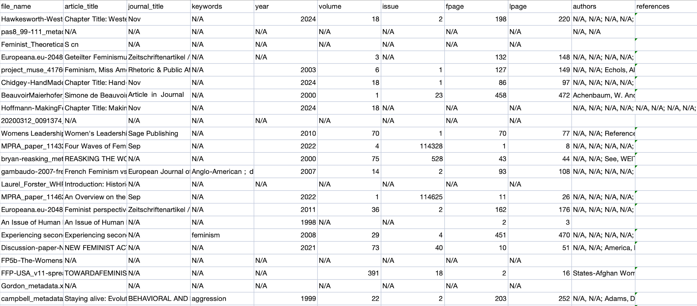

# Chapter 9

## Abstract

The feminist movement's legacy, documented in a diverse collection of texts, is a vital resource for understanding societal transformations and activism. However, preserving and organizing these materials efficiently poses significant challenges. This paper explores the application of automated metadata extraction using CERMINE to archive U.S. feminist movement literature. By processing a curated dataset of PDF documents, the study develops a structured database to enhance accessibility and organization. This approach demonstrates how automation can streamline archival practices, saving time while ensuring accuracy. Through detailed experiments, the study evaluates the workflow’s efficiency, accuracy, and adaptability, identifying strengths and limitations. The findings underline the transformative potential of AI in digital humanities while offering a practical blueprint for future feminist archives.

## Introduction

Feminism, as a social and political movement, has left a lasting legacy that continues to influence societies globally. This legacy is intricately tied to a rich body of literature that spans generations, covering manifestos, essays, academic publications, speeches, and reports. These texts not only document the historical progression of feminist ideas but also serve as critical tools for understanding the social and political forces that shaped the movement. However, as the volume and diversity of feminist literature grow, so does the complexity of preserving, organizing, and making these texts accessible for future research and analysis.

Traditional methods of archiving, though thorough and often detailed, are no longer sufficient to address the challenges posed by the increasing scale of feminist archives. These methods rely heavily on human effort, requiring meticulous cataloging, annotation, and indexing. While this ensures a high level of accuracy, it is an unsustainable approach for large collections or those comprising documents in varied formats, such as scanned PDFs, handwritten notes, and digitally native texts. In such cases, manual processes are not only time-consuming but also prone to errors and inconsistencies, particularly when dealing with older documents that may have suffered degradation or poor preservation practices.

Enter the era of digital humanities, where the integration of computational tools into traditional humanities disciplines opens up new avenues for research and preservation. One of the most promising developments in this field is the use of automated metadata extraction techniques to streamline archival practices. Metadata, which provides structured information about a document—such as its title, author, publication date, and thematic keywords—serves as the backbone of any digital archive. Properly extracted and organized metadata allows researchers to navigate vast collections efficiently, enabling advanced search functionalities and thematic analyses that were previously unimaginable.

Automated metadata extraction tools, such as CERMINE, represent a paradigm shift in how archival tasks are approached. By combining rule-based methods with machine learning algorithms, these tools can process large volumes of documents in a fraction of the time required for manual annotation. They also bring a level of consistency and scalability that is difficult to achieve with human effort alone. For feminist archives, the potential applications are immense. Automated tools can help track the evolution of key ideas, such as reproductive rights, intersectionality, and labor justice, providing a data-driven perspective on the movement's history.

Despite these advantages, the application of automated tools to feminist literature is not without its challenges. Feminist texts often defy standardization, reflecting the diverse voices and formats of their creators. Keywords, for instance, carry different meanings depending on their historical and socio-political contexts. A term like "suffrage" may resonate differently in the context of early 20th-century feminism compared to contemporary discussions of voting rights. Similarly, the richness of feminist literature often lies in its nuanced interplay of personal narratives and collective struggles—elements that metadata, by its very nature, struggles to encapsulate.

This study seeks to address these challenges by exploring the application of CERMINE, an open-source automated metadata extraction tool, to a curated dataset of feminist literature. The dataset includes 50 documents sourced from platforms such as JSTOR, SSOAR, and the Great Transition Initiative, representing a wide range of feminist thought from the 1960s to the present. By focusing on the capabilities and limitations of CERMINE, this research aims to evaluate how automated tools can contribute to the preservation and accessibility of feminist literature.

Furthermore, the study delves into the broader implications of using AI-driven tools in digital humanities. How do these technologies shape our understanding of archival practices? What are their ethical considerations, particularly when dealing with sensitive historical materials? And how can they be improved to better serve the needs of feminist scholars and activists? These questions form the foundation of the research, positioning it at the intersection of technology, humanities, and activism.

Ultimately, the goal is not merely to assess the technical performance of CERMINE but to highlight the transformative potential of digital tools in preserving feminist legacies. By doing so, this study aims to contribute to the growing body of work in digital humanities, offering insights that extend beyond feminist archives to encompass broader archival practices and methodologies.

**Application-Specific Research**

Some studies optimize metadata extraction for specific contexts. {cite:p}`cortez2009flexible` modified the FLUX-CiM system for metadata extraction in multiple domains and highlighted the advantages of applying domain-specific knowledge. {cite:p}`khan2023metadata` addressed the challenges faced by low-resource languages in digital news archives and suggested strategies to improve metadata extraction. {cite:p}`nayaka2023efficient` developed a framework that extracts algorithm-specific metadata by automating the identification of pseudo-code and related attributes, which supports academic searches. Riley (2017) analyzed metadata types and their applications in cultural heritage, where she provided a comprehensive overview of best practices and standards.

This study uses CERMINE because it combines rule-based methods with machine learning techniques, which ensures that it adapts to a wide range of document layouts. It does not require a large amount of training data, which makes it suitable for small projects where resources are limited. Its modular design ensures efficient processing of scientific documents and provides metadata in structured formats, such as CSV and XML, which simplifies storage and analysis. Evaluations show that CERMINE achieves higher precision and adaptability than other tools, such as GROBID and ParsCit. These features make CERMINE a suitable choice for this project, which focuses on U.S. feminist literature.

**Feminist Archives and Digital Humanities**

Feminist archives represent a treasure trove of knowledge, documenting decades of activism, scholarship, and societal transformation. These archives serve as both a testament to the achievements of feminist movements and a resource for future generations to explore the complexities of gender and social justice. However, the diversity and sheer volume of feminist literature pose significant challenges to traditional archival practices. This is where digital humanities, with its integration of computational tools into humanities research, offers transformative possibilities.

Digital humanities have redefined the way we approach archival tasks, moving beyond mere preservation to encompass analysis, visualization, and accessibility. Feminist archives, in particular, benefit immensely from these advancements. The integration of automated metadata extraction tools allows for the efficient organization of large collections, enabling researchers to uncover patterns and trends that would otherwise remain hidden in vast amounts of data. For instance, by analyzing thematic keywords across decades, scholars can trace the evolution of feminist thought from issues like suffrage and reproductive rights to contemporary concerns such as intersectionality and trans-inclusivity.

Moreover, digital tools democratize access to feminist literature. Historically, access to archival materials has often been limited to scholars in well-funded institutions, restricting the reach of these vital resources. By digitizing feminist texts and creating metadata-rich databases, archives can make these materials accessible to a global audience, empowering researchers, activists, and educators. This democratization aligns with the core values of feminism, ensuring that knowledge is not confined by geographical or institutional boundaries.

However, the intersection of feminist archives and digital humanities is not without its challenges. Automated tools, while efficient, often struggle to capture the nuanced socio-political contexts of feminist texts. Metadata abstraction can obscure the lived realities and grassroots activism embedded in these works, necessitating supplementary human oversight to enrich the archive. Despite these limitations, digital humanities provide an invaluable framework for preserving feminist legacies and fostering their continued relevance in contemporary discourse.

## Methods & Data

#### Data Collection

For this study, a dataset of 50 PDF documents was selected to represent key U.S. feminist texts, including manifestos, journal articles, academic papers, and reports. These documents span several decades, beginning from the 1960s to the present, and reflect the evolving themes within the feminist movement. The texts cover a wide range of topics, including reproductive rights, gender equality, intersectionality, labor rights, and social justice. Sources included academic platforms such as JSTOR and SSOAR.

The selection of documents was designed to ensure a broad representation of feminist thought, encompassing both foundational texts and more recent writings that address contemporary feminist issues. By focusing on U.S. feminist literature, the study aims to capture significant historical shifts within the movement, as well as the intersectional developments that have emerged in more recent decades. Sources were drawn from platforms such as: {cite:p}`jstor`, {cite:p}`bepress`, {cite:p}`mpra`, {cite:p}`greattransition`, {cite:p}`ssoar`.

#### Workflow

The study developed a workflow that integrates CERMINE {cite:p}`tkaczyk2015cermine` for metadata extraction, Python scripts for data transformation, and an SQLite database for storage. The steps involved are as follows:

1. Metadata Extraction: CERMINE is used to extract metadata from PDF documents. The tool processes each document and generates an XML file containing metadata such as title, author, publication date, and keywords.

2. Data Transformation: The XML files are parsed using Python’s xml.etree.ElementTree library {cite:p}`python_elementtree`. The extracted metadata is then transformed into a CSV format, which is structured to include the following fields:

- file_name
- article_title
- journal_title
- keywords
- year
- volume
- issue
- fpage
- lpage
- authors

3. Database Integration: The CSV file is imported into an SQLite database {cite:p}`python_sqlite3`. The database is structured with tables corresponding to the metadata fields, enabling efficient querying and analysis.
This workflow ensures that the metadata is organized, searchable, and ready for future analysis.

## Experiment

The experiment consisted of three main steps: extracting metadata from PDF files, converting the extracted XML metadata into a CSV file, and importing the consolidated metadata into an SQLite database.

1. Step 1: Metadata Extraction

The first step in the experiment involves extracting metadata from PDF files. To achieve this, we design a script, which automates the process by using the CERMINE tool. This script processes all PDF files stored in a specified input folder and extracts structured metadata such as article titles, journal names, authors, and publication dates. The extracted metadata is saved in XML format, which provides input for the next steps in the experiment. The script ensures that each file is processed individually.

The script begins by defining two key paths: the input_folder, which contains the PDF files, and the output_folder, where the XML files are saved. These paths can be customized to adapt the script to different datasets. 

Then we uses a loop to process each PDF file. For every file, it extracts the base name, appends the .xml extension, and creates an output file. This step ensures that the name of the XML file corresponds to the original PDF file, as shown in the following lines:

```bash
for pdf_file in "$input_folder"/*.pdf; do
    output_file="$output_folder/$(basename "$pdf_file" .pdf).xml"
    java -cp cermine-impl-1.13-jar-with-dependencies.jar \
         pl.edu.icm.cermine.PdfNLMContentExtractor -path "$pdf_file" > "$output_file"
done
```
In the loop, the script runs the CERMINE tool with the following command:

```bash
java -cp cermine-impl-1.13-jar-with-dependencies.jar \
     pl.edu.icm.cermine.PdfNLMContentExtractor -path "$pdf_file" > "$output_file"
```

This command uses CERMINE to extract metadata, specifies the class responsible for processing PDF files, and converts their contents into a structured XML format. The extracted metadata is then saved to the output file.

By the end of this step, the output folder contains a corresponding XML file for each PDF document. This step ensures that metadata is extracted systematically, forming a reliable foundation for further analysis.

2. Step 2: XML to CSV Conversion

In the second step of the experiment, we designed a Python script to process the XML metadata files generated in Step 1 and consolidate their contents into a single CSV file. This script automates the parsing and extraction of structured metadata, including key fields like article titles, journal names, authors, and publication years, etc. The goal of this step is to ensure that the metadata is stored in a unified format, facilitating easier data handling and subsequent analysis.

First of all we import essential libraries. Use Python's os module for file management, csv module for writing data into a CSV file, and xml.etree.ElementTree (ET) for parsing XML files. This ensures that the script can read XML files, extract metadata, and save the results in a structured CSV format.

We iterate through all XML files in the specified input folder and calls the parse_xml_file function for each file. The extracted metadata is stored in a list called all_metadata, which accumulates the metadata for all processed files. Below is the relevant portion of the script:

```bash  
all_metadata = []  
for file_name in os.listdir(input_folder):  
    if file_name.endswith(".xml"):  
        file_path = os.path.join(input_folder, file_name)  
        metadata = parse_xml_file(file_path)  
        if metadata:  
            all_metadata.append(metadata)  
```

The parse_xml_file function extracts key metadata fields from each XML file. For instance, it retrieves the article title, journal title, and publication year using the findtext method, which simplifies the process of locating specific XML tags. Here is how these operations are implemented in the script:

```bash
metadata = {
            "file_name": os.path.basename(xml_file),
            "article_title": root.findtext(".//article-title", default="N/A"),
            "journal_title": root.findtext(".//journal-title", default="N/A"),
            "keywords": root.findtext(".//kwd", default="N/A").replace("◆", "; ").strip(),
            "year": root.findtext(".//pub-date/year", default="N/A"),
            "volume": root.findtext(".//volume", default="N/A"),
            "issue": root.findtext(".//issue", default="N/A"),
            "fpage": root.findtext(".//fpage", default="N/A"),
            "lpage": root.findtext(".//lpage", default="N/A"),
            "authors": [],
            "references": []
```

After parsing the XML files and storing their metadata in the all_metadata list, we write this data into a CSV file. We use Python's csv.DictWriter to ensure that the data is correctly formatted, with predefined column headers like file_name, article_title, and authors. This ensures that each row in the CSV file corresponds to the metadata of a single XML file. Below is the code for writing the CSV file:

```bash
with open(output_csv, "w", newline="", encoding="utf-8") as csvfile:
    fieldnames = [
        "file_name",
        "article_title",
        "journal_title",
        "keywords", 
        "year",
        "volume",
        "issue",
        "fpage",
        "lpage",
        "authors",
        "references"
    ]
    writer = csv.DictWriter(csvfile, fieldnames=fieldnames)
    writer.writeheader()

    for metadata in all_metadata:
        writer.writerow({
            "file_name": metadata["file_name"],
            "article_title": metadata["article_title"],
            "journal_title": metadata["journal_title"],
            "keywords": metadata["keywords"],  
            "year": metadata["year"],
            "volume": metadata["volume"],
            "issue": metadata["issue"],
            "fpage": metadata["fpage"],
            "lpage": metadata["lpage"],
            "authors": "; ".join(metadata["authors"]),
            "references": "; ".join(metadata["references"])
        })
```

By the end of this step, the script generates a CSV file that consolidates metadata from all XML files in a structured and searchable format. This automation not only saves time but also minimizes the risk of human error in data entry.


<figcaption>Figure 1: Structured metadata stored in the CSV file, displaying fields such as file_name, article_title, journal_title, and others.</figcaption>
<br>
3. Step 3: Importing Metadata into SQLite

The third step of the experiment involves importing the metadata stored in the CSV file into an SQLite database. We also write a Python script to achieve this.

We begin by importing the necessary Python libraries. We pandas to read the CSV file and sqlite3 to interact with the SQLite database. These libraries are essential for ensuring that data from the CSV file is seamlessly transferred into the database.

Then we read the content of the CSV file into a pandas DataFrame. This allows for manipulation and access to the data before inserting it into the database. The path to the CSV file is specified, and the read_csv method loads the data into a structured format.

```bash
csv_file = "/path/to/metadata.csv"  
df = pd.read_csv(csv_file)  
```

Next, we establishes a connection to the SQLite database using the sqlite3 library. If the database file (feminist_literature.db) does not exist, SQLite automatically creates it. This connection allows the script to execute SQL commands and interact with the database.

```bash
conn = sqlite3.connect("feminist_literature.db")  
cursor = conn.cursor()  
```

We then create a new table in the SQLite database to store the metadata. It uses an SQL CREATE TABLE statement, which defines the table structure and its columns. The column names and data types match the fields in the CSV file to ensure compatibility.

```bash
cursor.execute("""  
CREATE TABLE IF NOT EXISTS feminist_metadata (  
    file_name TEXT,  
    article_title TEXT,  
    journal_title TEXT,  
    keywords TEXT,  
    year TEXT,  
    volume TEXT,  
    issue TEXT,  
    fpage TEXT,  
    lpage TEXT,  
    authors TEXT  
)  
""")  
```

This step ensures that the table feminist_metadata exists and has the appropriate structure to store the extracted metadata.

After creating the table, we inserts the data from the pandas DataFrame into the SQLite database. This is done using the to_sql method, which simplifies the insertion process by automatically handling the data mapping between the DataFrame and the database table.

```bash
df.to_sql("feminist_metadata", conn, if_exists="append", index=False)  
```

The if_exists="append" parameter ensures that new data is added to the table without overwriting existing records.

By the end of this step, we import the metadata into the SQLite database to make it ready for efficient querying and analysis. The automation of this process streamlines data management and allows for more sophisticated data operations in future research.


<figcaption>Figure 2: SQLite interface showing the imported metadata from the CSV file, with each row representing a single record and columns matching the CSV fields. All extracted metadata can be managed, retrieved, viewed, and further processed through this platform.</figcaption>
<br>
This experiment extracted metadata from PDF files, converted it into a structured CSV file, and stored it in a database for further analysis. By using shell scripts and Python tools, the workflow achieved both efficiency and consistency. This established a robust pipeline, transforming raw data into a searchable database, which facilitates in-depth metadata analysis.

## Results

#### Performance Metrics

The evaluation of performance metrics in this study centered on three critical dimensions: efficiency, accuracy, and adaptability. Efficiency was one of the standout features of the workflow, with the ability to process 50 documents in under an hour—a stark contrast to the hours or even days required for manual annotation. This rapid processing time demonstrates the scalability of automated tools like CERMINE, particularly for large datasets that would overwhelm traditional archival methods.

Accuracy was measured across various metadata fields, revealing nuanced results. Structured fields such as titles, authors, and publication years achieved a high level of precision. These elements benefited from the relatively standardized nature of academic texts, which provided a consistent framework for metadata extraction. However, thematic keywords presented a more complex challenge as they were understood as the keyword section in academic papers. This discrepancy underscores the inherent variability of language in feminist literature, where terms carry layered meanings influenced by historical and socio-political contexts. For instance, a keyword like "equality" might denote distinct concepts depending on the era or author, complicating its extraction and categorization.

Adaptability emerged as another critical metric, reflecting the tool’s ability to handle diverse document formats. While CERMINE performed admirably with standard layouts, such as academic journal articles, it encountered difficulties with less conventional formats. Handwritten annotations, low-quality scans, and documents with complex layouts often required manual intervention, reducing overall efficiency. This limitation highlights the need for enhancements in OCR technology and algorithmic flexibility to accommodate the diverse nature of archival materials.

Overall, these performance metrics illustrate both the strengths and challenges of using automated metadata extraction tools in feminist archives. While tools like CERMINE offer significant improvements in efficiency and scalability, their limitations in handling nuanced and non-standard data highlight the continued importance of human oversight in the archiving process.

#### Insights from Metadata

The metadata allowed for the identification of key themes and trends within the feminist movement. For instance, keywords from the 1960s to the 1980s often included terms like “reproductive rights,” “gender equality,” and “suffrage,” while more recent texts featured keywords related to intersectionality, such as “race and gender” and “transfeminism.” This shift in focus highlights the evolving nature of feminist thought and demonstrates the value of metadata in tracking such changes over time.

#### Discussion

The results confirm the utility of automated metadata extraction for feminist archives. By significantly reducing the time required for metadata generation, this approach offers a scalable solution for archiving large collections of feminist literature. The structured metadata created by CERMINE enables efficient searches and provides a foundation for deeper analysis of the feminist movement’s intellectual and political evolution.

However, limitations remain. Non-standard document formats, such as low-quality scans or handwritten notes, pose significant challenges to fully automating the extraction process. These documents often require manual intervention, which reduces the overall efficiency of the system. Additionally, while the metadata structure allows for easy search and retrieval, it may not capture the full context or nuance of feminist texts. Metadata is an abstraction of the text, and some level of detail—especially socio-political context—may be lost in the extraction process.

#### Limitations

While this study highlights the transformative potential of automated metadata extraction in feminist archives, it also reveals several critical limitations. First, the quality of input documents significantly impacts the workflow. Low-resolution scans, handwritten notes, and irregular layouts posed challenges for CERMINE, requiring manual corrections that reduced overall efficiency.

Another key limitation lies in keyword extraction. Feminist literature often features language that evolves over time, with terms like "intersectionality" or "suffrage" carrying varied meanings depending on the historical context. This variability lowered the precision of thematic keywords, complicating efforts to track ideological shifts across decades.

Moreover, metadata abstraction inherently limits the ability to fully represent the socio-political context of feminist texts. While metadata facilitates organization and analysis, it cannot capture the intricate interplay of personal narratives, grassroots activism, and cultural dynamics that define feminist literature. As Jane Greenberg {cite:p}` greenberg2004metadata` noted, “The best metadata generation option is to integrate both human and automatic processes”​. This integration is essential to address the gaps left by automated systems, enriching metadata with contextual annotations and human insight.

Finally, the lack of benchmark comparisons for CERMINE limited the study’s ability to evaluate its performance relative to other tools. Future research should include comparative analyses to establish a clearer picture of CERMINE’s strengths and weaknesses.
## Conclusion and Outlook

This study has demonstrated the potential of automated metadata extraction for feminist archives. By significantly improving the efficiency and accuracy of metadata generation, this approach offers a scalable solution for archiving and preserving feminist texts. The use of CERMINE and Python tools shows that AI-driven metadata extraction can streamline archival practices, making vast amounts of data more accessible for research. 

Future research should address the limitations identified in this study. Improving OCR capabilities and enhancing algorithms to better handle non-standard formats will be essential for increasing the system’s overall efficiency. Moreover, refining keyword extraction to handle evolving feminist terminology will make the process even more accurate. There is also potential for integrating multimodal data (such as images, audio, and video), which would enrich feminist archives and provide a more holistic view of the movement’s impact.

By embracing digital tools, we can ensure that feminist legacies are not only preserved but are also accessible and meaningful to future generations of scholars, activists, and the public.

## Tools and References

```{bibliography} references_chapter9.bib
